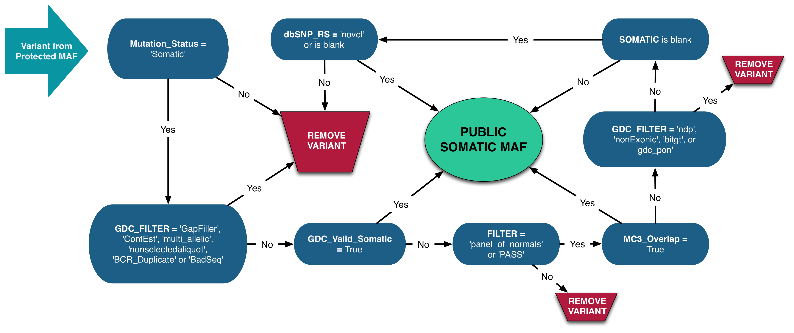

# GDC MAF Format

## Introduction

Mutation Annotation Format (MAF) is a tab-delimited text file with aggregated mutation information from [VCF Files](VCF_Format.md) and are generated on a project or aliquot level.  The GDC produces MAF files at two permission levels: controlled and open access. Annotated VCF files, Annotated somatic mutations, often have variants reported on multiple transcripts whereas the MAF files generated from the VCFs, Aggregated somatic mutations, only report the most critically affected one. [Masked Somatic Mutation](https://docs.gdc.cancer.gov/Data_Dictionary/viewer/#?view=table-definition-view&id=masked_somatic_mutation) files are further processed to remove lower quality and potential germline variants. Masked Somatic MAFs are publicly available and can be freely distributed within the boundaries of the [GDC Data Access Policies](https://gdc.cancer.gov/access-data/data-access-policies).

### Project-Level MAF Files v.1.0.0

Project-level MAF files are produced by aggregating the GDC annotated somatic mutation VCF files generated from each pipeline for one project. The MAF files are produced through the [Somatic Aggregation Workflow](https://docs.gdc.cancer.gov/Data_Dictionary/viewer/#?view=table-definition-view&id=somatic_aggregation_workflow&_top=1). For tumor samples that contain variants from multiple combinations of tumor-normal aliquot pairs, only one pair is selected in the Somatic MAF based on their sample type. 

> __Note:__ The criteria for allowing mutations into open-access are purposefully implemented to overcompensate and filter out germline variants. If omission of true-positive somatic mutations is a concern, the GDC recommends using protected MAFs.  

#### Somatic MAF File Generation

The process for modifying a protected MAF into a somatic MAF is as follows:

*  Aliquot Selection: only one tumor-normal pair are selected for each tumor sample based on the plate number, sample type, analyte type and other features extracted from tumor TCGA aliquot barcode.
*  Low quality variant filtering and germline masking:
    1. Variants with __Mutation_Status != 'Somatic'__ or __GDC_FILTER = 'Gapfiller', 'ContEst', 'multiallelic', 'nonselectedaliquot', 'BCR_Duplicate' or 'BadSeq'__ are __removed__.
    2. Remaining variants with __GDC_Valid_Somatic = True__ are __included__ in the Somatic MAF.
    3. Remaining variants with __FILTER != 'panel_of_normals' or PASS__ are __removed__. Note that the `FILTER != panel_of_normals` value is only relevant for the variants generated from the MuTect2 pipeline.
    4. Remaining variants with __MC3_Overlap = True__ are __included__ in the Somatic MAF.
    5. Remaining variants with __GDC_FILTER = 'ndp', 'NonExonic', 'bitgt', 'gdc_pon'__ are __removed__.
    6. Remaining variants with __SOMATIC != null__ are __included__ in the Somatic MAF.
    7. Remaining variants with __dbSNP_RS = 'novel' or null__ are __included__ in the Somatic MAF.
    8. Remaining variants are __removed__.
* Removal of the following columns:
    * vcf_region
    * vcf_info
    * vcf_format
    * vcf_tumor_gt
    * vcf_normal_gt
    * GDC_Valid_Somatic
* Set values to be blank in the following columns that may contain information about germline genotypes:
    * Match_Norm_Seq_Allele1
    * Match_Norm_Seq_Allele2
    * Match_Norm_Validation_Allele1
    * Match_Norm_Validation_Allele2
    * n_ref_count
    * n_alt_count

---

---

### Aliquot-Level MAF Files

Aliquot-level MAF files, annotated somatic mutations, are produced for each aliquot per pipeline. These files are then run through the Aliquot Ensemble Somatic Variant Merging and Masking workflow. This will aggregate the files into an aggregated somatic mutation MAF as well as filter the variants creating the masked somatic mutation MAF.

#### Aliquot-Level File Generation

The process for modifying the Aliquot-level MAF files into a masked somatic mutation Aliquot-level MAF is as follows:

*  The annotated somatic mutations Aliquot-level MAF files, produced from the different callers, are merged into one raw merged Aliquot-level MAF file and selection for the variants are made based on the following filters.
*  Low quality variant filtering and germline masking:
    1. The variant must occur within at least two of the callers.
    2. Remaining variants with __FILTER != panel_of_normals__ are __removed__. Note that the `FILTER != panel_of_normals` value is only relevant for the variants generated from the MuTect2 pipeline.
    3. The __non-TCGA exac allele frequency__ variants (0.001; common\_in\_exac) are __kept__.
    4. If any of the variants __based on step 2 and step 3 are removed__, but are known __cancer hotspots__ (Chang et al., 2018), they will instead be __kept__.
    5. Of those variants, if any have a __read depth of 7 or less__ (ndp flag), they will be __removed__.
    6. Variants that __do not overlap with a gencode exon__ will be __removed__ (GDC_FILTER = 'NonExonic').
    7. Variants that are __multiallelic__ will be __removed__ (GDC_FILTER ='multiallelic').
    8. Variants that are __"off target"__ will be __removed__.
    9. Of the remaining variants, these are then combined into the Masked Merged Aliquot-level MAF.

---

---

## MAF File Structure

The MAF files structure can be found in the following github repository:

[MAF Repository](https://github.com/NCI-GDC/maf-lib/tree/master/src/maflib/resources)
