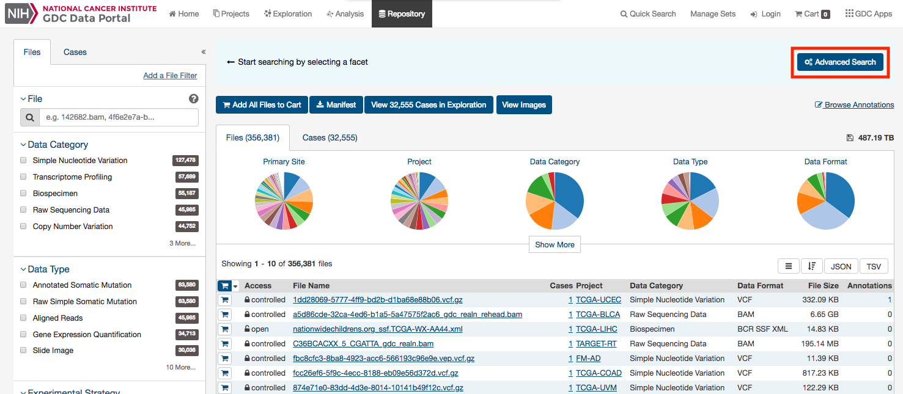
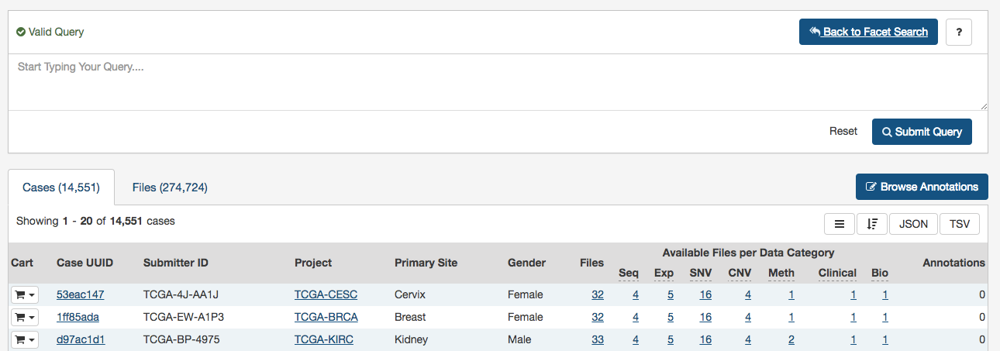
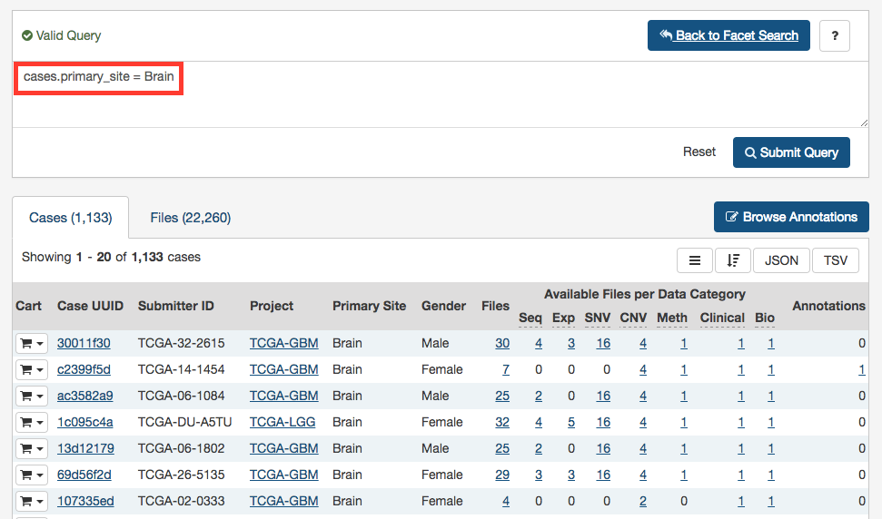
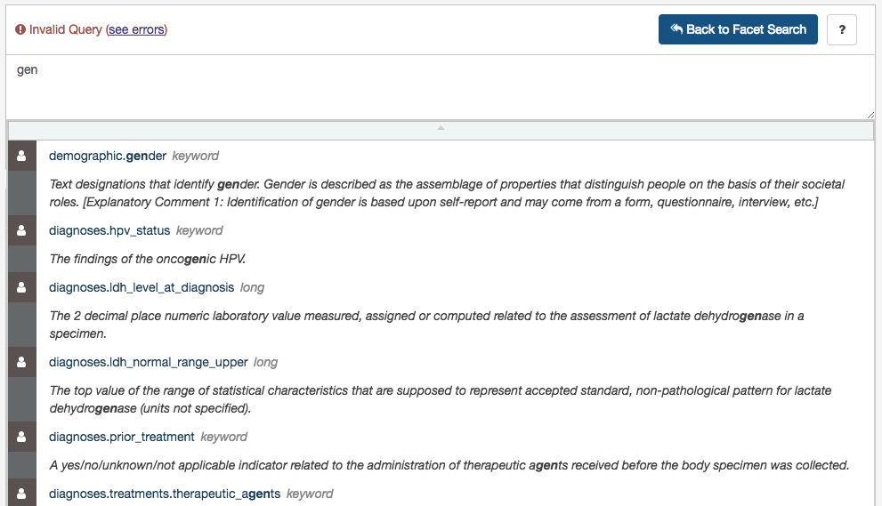
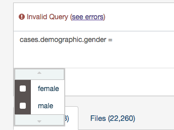

# Advanced Search

Only available in the Repository view, the Advanced Search page offers complex query building capabilities to identify specific set of cases and files.

## Overview: GQL

Advanced search allows, via Genomic Query Language (GQL), to use structured queries to search for files and cases.

A simple query in GQL (also known as a 'clause') consists of a __field__, followed by an __operator__, followed by one or more __values__. For example, the simple query `cases.primary_site = Brain` will find all cases for projects in which the primary site is Brain:

Note that it is not possible to compare two fields (e.g. disease_type = project.name).

> __Note:__ GQL is not a database query language. For example, GQL does not have a "SELECT" statement.

### Switching between Advanced Search and Facet Filters

When accessing Advanced Search from Repository View, a query created using facet filters in Repository View will be automatically translated to an Advanced Search GQL Query.

A query created in Advanced Search is not translated back to facet filters. Clicking on "Back to Facet Search" will return the user to Data View and reset the filters.

## Using the Advanced Search

When opening the advanced search page (via the Repository view), the search field will be automatically populated with facets filters already applied (if any).

This default query can be removed by pressing "Reset".

Once the query has been entered and is identified as a "Valid Query", click on "Search" to run your query.

### Auto-complete

As a query is being written, the GDC Data Portal will analyze the context and offer a list of auto-complete suggestions. Auto-complete suggests both fields and values as described below.

### Field Auto-complete

The list of auto-complete suggestions includes __all__ available fields matching the user text input. The user has to scroll down to see more fields in the dropdown:

### Value Auto-complete

The list of auto-complete suggestions includes top 100 values that match the user text input. The user has to scroll down to see more values in the dropdown.

The value auto-complete is not aware of the general context of the query, the system will display all available values in GDC for the selected field. It means the query could return 0 results depending of other filters.

> __Note:__ Quotes are automatically added to the value if it contains spaces.

## Setting Precedence of Operators

You can use parentheses in complex GQL statements to enforce the precedence of operators.

For example, if you want to find all the open files in TCGA program as well as the files in TARGET program, you can use parentheses to enforce the precedence of the boolean operators in your query, i.e.:

	(files.access = open and cases.project.program.name = TCGA) or cases.project.program.name = TARGET

> __Note:__ Without parentheses, the statement will be evaluated left-to-right.

## Keywords

A GQL keyword is a word that joins two or more clauses together to form a complex GQL query.

**List of Keywords:**

*   __AND__
*   __OR__

> __Note:__ Parentheses can be used to control the order in which clauses are executed.

### "__AND__" Keyword

Used to combine multiple clauses, allowing you to refine your search.

Examples:

* Find all open files in breast cancer:

		cases.primary_site = Breast and files.access = open

* Find all open files in breast cancer and data type is gene expression quantification:

		cases.primary_site = Breast and files.access = open and files.data_type = "Gene Expression Quantification"

### "__OR__" Keyword

Used to combine multiple clauses, allowing you to expand your search.

> __Note:__ __IN__ keyword can be an alternative to __OR__ and result in simplified queries.

Examples:

*   Find all files that are raw sequencing data or aligned reads:

		files.data_type = "Aligned Reads" or files.data_type = "Raw sequencing data"

*   Find all files where donors are male or vital status is alive:

		cases.demographic.gender = male or cases.diagnoses.vital_status = alive

## Operators

An operator in GQL is one or more symbols or words comparing the value of a field on its left with one or more values on its right, such that only true results are retrieved by the clause.

### List of Operators and Query format

| Operator | Description |
| --- | --- |
| = | Field EQUAL Value (String or Number) |
| != | Field NOT EQUAL Value (String or Number) |
| < | Field LOWER THAN Value (Number or Date) |
| <= | Field LOWER THAN OR EQUAL Value (Number or Date) |
| \> | Field GREATER THAN Value (Number or Date) |
| \>= | Field GREATER THAN OR EQUAL Value (Number or Date) |
| IN | Field IN [Value 1, Value 2] |
| EXCLUDE | Field EXCLUDE [Value 1, Value 2] |
| IS MISSING | Field IS MISSING |
| NOT MISSING | Field NOT MISSING |

### "__=__" operator - __EQUAL__

The "__=__" operator is used to search for files where the value of the specified field exactly matches the specified value.

Examples:

*   Find all files that are gene expression quantification:

		files.data_type = "Gene Expression Quantification"

*   Find all cases whose gender is female:

		cases.demographic.gender = female

### "__!=__" operator - __NOT EQUAL__

The "__!=__" operator is used to search for files where the value of the specified field does not match the specified value.

The "__!=__" operator will not match a field that has no value (i.e. a field that is empty). For example:
	
		gender != male

This search will only match cases who have a gender and the gender is not male. To find cases other than male or with no gender populated, you would need to search:

		gender != male or gender is missing.

Example:

*   Find all files with an experimental strategy that is not genotyping array:

		files.experimental_strategy != "Genotyping array"

### "__>__" operator - __GREATER THAN__

The "__>__" operator is used to search for files where the value of the specified field is greater than the specified value.

Example:

* Find all cases whose number of days to death is greater than 60:

		cases.diagnoses.days_to_death > 60

### "__>=__" operator - __GREATER THAN OR EQUALS__

The "__>=__" operator is used to search for files where the value of the specified field is greater than or equal to the specified value.

Example:

* Find all cases whose number of days to death is equal or greater than 60:

		cases.diagnoses.days_to_death >= 60

### "__<__" operator - __LESS THAN__

The "__<__" operator is used to search for files where the value of the specified field is less than the specified value.

Example:

*   Find all cases whose age at diagnosis is less than 400 days:

		cases.diagnoses.age_at_diagnosis < 400

### "__<=__" operator - __LESS THAN OR EQUALS__

The "__<=__" operator is used to search for files where the value of the specified field is less than or equal to the specified value.

Example:

*   Find all cases with a number of days to death less than or equal to 20:

		cases.diagnoses.days_to_death <= 20

### "__IN__" operator

The "__IN__" operator is used to search for files where the value of the specified field is one of multiple specified values. The values are specified as a comma-delimited list, surrounded by brackets [ ].

Using "__IN__" is equivalent to using multiple "__=__" (__EQUALS__) statements, but is shorter and more convenient. That is, these two following statement will retrieve the same output:

		project IN [ProjectA, ProjectB, ProjectC] 
		project = "ProjectA" OR project = "ProjectB" OR project = "ProjectC"

Examples:

*   Find all files in breast, brain, and lung cancer:

		cases.primary_site IN [Breast, Brain, Lung]

*   Find all files that annotated somactic mutations or the raw simple somatic mutations:

		files.data_type IN ["Annotated Somatic Mutation", "Raw Simple Somatic Mutation"]

### "__EXCLUDE__" operator

The "__EXCLUDE__" operator is used to search for files where the value of the specified field is not one of multiple specified values.

Using "__EXCLUDE__" is equivalent to using multiple "__!=__" (__NOT_EQUALS__) statements, but is shorter and more convenient. That is, these two following statement will retrieve the same output:

		project EXCLUDE [ProjectA, ProjectB, ProjectC]
		project != "ProjectA" OR project != "ProjectB" OR project != "ProjectC"

The "__EXCLUDE__" operator will not match a field that has no value (i.e. a field that is empty). For example:

		files.experimental_strategy EXCLUDE ["WGS","WXS"] 

This search will only match files that have an experimental strategy **and** the experimental strategy is not "WGS" or "WXS". To find files with an experimental strategy different from than "WGS" or "WXS" **or is not assigned**, you would need to type:

		files.experimental_strategy in ["WXS","WGS"] or files.experimental_strategy is missing

Examples:

*   Find all files where experimental strategy is not WXS, WGS, Genotyping array:

		files.experimental_strategy EXCLUDE [WXS, WGS, "Genotyping array"]

### "__IS MISSING__" operator

The "__IS__" operator can only be used with "__MISSING__". That is, it is used to search for files where the specified field has no value.

Examples:

*   Find all cases where gender is missing:

		cases.demographic.gender is MISSING

### "__NOT MISSING__" operator

The "__NOT__" operator can only be used with "__MISSING__". That is, it is used to search for files where the specified field has a value.

Examples:

*   Find all cases where race is not missing:

		cases.demographic.race NOT MISSING

## Special Cases

### Date format

The date format should be the following: **YYYY-MM-DD** (without quotes).

Example:

		files.updated_datetime > 2015-12-31

### Using Quotes

A value must be quoted if it contains a space. Otherwise the advanced search will not be able to interpret the value.

Quotes are not necessary if the value consists of one single word.

* Example: Find all cases with primary site is brain and data type is copy number segment:

		cases.primary_site = Brain and files.data_type = "Copy Number Segment"

### Age at Diagnosis - Unit in Days

The unit for age at diagnosis is in **days**. The user has to convert the number of years to number of days.

The __conversion factor__ is 1 year = 365.25 days

*   Example: Find all cases whose age at diagnosis > 40 years old (40 * 365.25)

		cases.diagnoses.age_at_diagnosis > 14610

## Fields Reference

The full list of fields available on the GDC Data Portal can be found through the GDC API using the following endpoint:

[https://api.gdc.cancer.gov/gql/_mapping](https://api.gdc.cancer.gov/gql/_mapping)