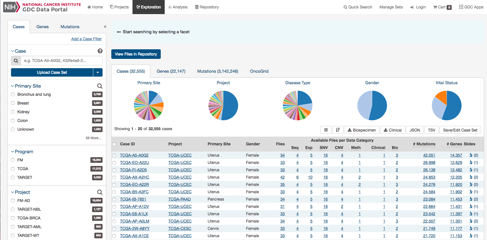
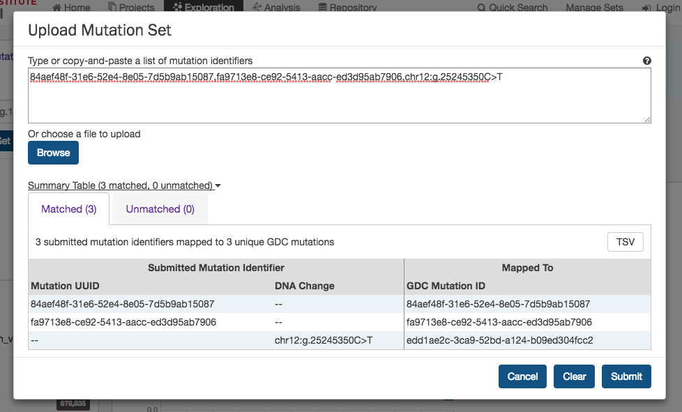
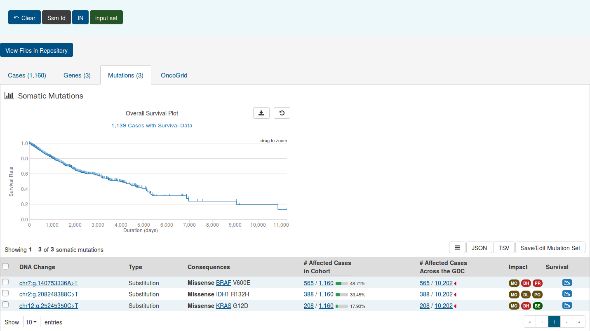
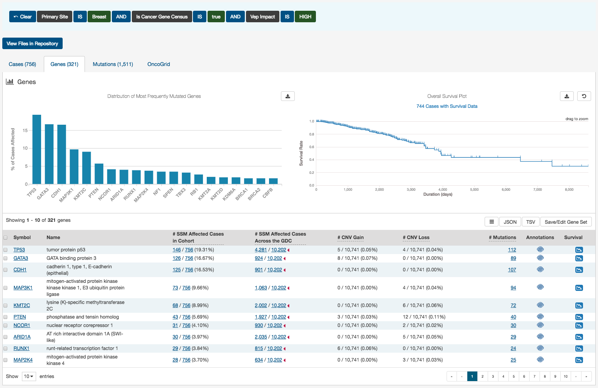

# Exploration

The Exploration page allows users to explore data in the GDC using advanced filters/facets, which includes those on a gene and mutation level. Users choose filters on specific `Cases`, `Genes`, and/or `Mutations` on the left of this page and then can visualize these results on the right.  The Gene/Mutation data for these visualizations comes from the Open-Access MAF files on the GDC Portal.

## Filters / Facets
On the left of this page, users can create advanced filters to narrow down results to create synthetic cohorts.

### Case Filters

The first tab of filters is for cases in the GDC.

These criteria limit the results only to specific cases within the GDC. The default filters available are:

* __Case__: Specify individual cases using submitter ID (barcode), UUID, or list of Cases ('Case Set')
* __Case Submitter ID__: Search for cases using a part (prefix) of the submitter ID (barcode).
* __Primary Site__: Anatomical site of the cancer under investigation or review.
* __Program__: A cancer research program, typically consisting of multiple focused projects.
* __Project__: A cancer research project, typically part of a larger cancer research program.
* __Disease Type__: Type of cancer studied.
* __Gender__: Gender of the patient.
* __Age at Diagnosis__: Patient age at the time of diagnosis.
* __Vital Status__: Indicator of whether the patient was living or deceased at the date of last contact.
* __Days to Death__: Number of days from date of diagnosis to death of the patient.
* __Race__: Race of the patient.
* __Ethnicity__: Ethnicity of the patient.

In addition to the defaults, users can add additional case filters by clicking on the link titled 'Add a Case Filter'

#### Upload Case Set

In the `Cases` filters panel, instead of supplying cases one-by-one, users can supply a list of cases.  Clicking on the `Upload Case Set` button will launch a dialog as shown below, where users can supply a list of cases or upload a comma-separated text file of cases.

After supplying a list of cases, a table below will appear which indicates whether the case was found.

Clicking on `Submit` will filter the results in the Exploration Page by those cases.

### Gene Filters

The second tab of filters is for genes affected by mutations in the GDC.

The second tab of filters are for specific genes.  Users can filter by:

* __Gene__ - Entering in a specific Gene Symbol, ID, or list of Genes ('Gene Set')
* __Biotype__ - Classification of the type of gene according to Ensembl. The biotypes can be grouped into protein coding, pseudogene, long noncoding and short noncoding. Examples of biotypes in each group are as follows:
    * __Protein coding__: IGC gene, IGD gene, IG gene, IGJ gene, IGLV gene, IGM gene, IGV gene, IGZ gene, nonsense mediated decay, nontranslating CDS, non stop decay, polymorphic pseudogene, TRC gene, TRD gene, TRJ gene.
    * __Pseudogene__: disrupted domain, IGC pseudogene, IGJ pseudogene, IG pseudogene, IGV pseudogene, processed pseudogene, transcribed processed pseudogene, transcribed unitary pseudogene, transcribed unprocessed pseudogene, translated processed pseudogene, TRJ pseudogene, unprocessed pseudogene
    * __Long noncoding__: 3prime overlapping ncrna, ambiguous orf, antisense, antisense RNA, lincRNA, ncrna host, processed transcript, sense intronic, sense overlapping
    * __Short noncoding__: miRNA, miRNA_pseudogene, miscRNA, miscRNA pseudogene, Mt rRNA, Mt tRNA, rRNA, scRNA, snlRNA, snoRNA, snRNA, tRNA, tRNA_pseudogene
* __Is Cancer Gene Census__ - Whether or not a gene is part of [The Cancer Gene Census](http://cancer.sanger.ac.uk/census/)

#### Upload Gene Set

In the `Genes` filters panel, instead of supplying genes one-by-one, users can supply a list of genes.  Clicking on the `Upload Gene Set` button will launch a dialog as shown below, where users can supply a list of genes or upload a comma-separated text file of genes.

After supplying a list of genes, a table below will appear which indicates whether the gene was found.

Clicking on `Submit` will filter the results in the Exploration Page by those genes.

### Mutation Filters

The final tab of filters is for specific mutations.

Users can filter by:

* __Mutation__ - Unique ID for that mutation.  Users can use the following:
    * UUID - c7c0aeaa-29ed-5a30-a9b6-395ba4133c63
    * DNA Change - 	chr12:g.121804752delC
    * COSMIC ID - COSM202522
    * List of any mutation UUIDs or DNA Change id's ('Mutation Set')
* __Consequence Type__ - Consequence type of this variation; [sequence ontology](http://www.sequenceontology.org/) terms
* __Impact__ - A subjective classification of the severity of the variant consequence. This information comes from the [Ensembl VEP](http://www.ensembl.org/info/genome/variation/predicted_data.html).
* __Type__ - A general classification of the mutation
* __Variant Caller__ - The variant caller used to identify the mutation
* __COSMIC ID__ - The identifier of the gene or mutation maintained in COSMIC, the Catalogue Of Somatic Mutations In Cancer
* __dbSNP rs ID__ - The reference SNP identifier maintained in dbSNP

#### Upload Mutation Set

In the `Mutations` filters panel, instead of supplying mutation id's one-by-one, users can supply a list of mutations.  Clicking on the `Upload Mutation Set` button will launch a dialog as shown below, where users can supply a list of mutations or upload a comma-separated text file of mutations.

After supplying a list of mutations, a table below will appear which indicates whether the mutation was found.

Clicking on `Submit` will filter the results in the Exploration Page by those mutations.

## Results

As users add filters to the data on the Exploration Page, the Results section will automatically be updated.  Results are divided into different tabs:  `Cases`, `Genes`, `Mutations`, and `OncoGrid`.  

To illustrate these tabs, Case, Gene, and Mutation filters have been chosen ( Genes in the Cancer Gene Census, that have HIGH VEP Impact for the TCGA-BRCA project) and a description of what each tab displays follows.

#### Cases

The `Cases` tab gives an overview of all the cases/patients who correspond to the filters chosen (Cohort).

The top of this section contains a few pie graphs with categorical information regarding the Primary Site, Project, Disease Type, Gender, and Vital Status.

Below these pie charts is a tabular view of cases (which can be exported, sorted and saved using the buttons on the right), that includes the following information:

* __Case ID (Submitter ID):__ The Case ID / submitter ID of that case/patient (i.e. TCGA Barcode)
* __Project:__ The study name for the project for which the case belongs
* __Primary Site:__ The primary site of the cancer/project
* __Gender:__ The gender of the case
* __Files:__ The total number of files available for that case
* __Available Files per Data Category:__ Five columns displaying the number of files available in each of the five data categories.  These link to the files for the specific case.
* __# Mutations:__ The number of SSMs (simple somatic mutations) detected in that case
* __# Genes:__ The number of genes affected by mutations in that case
* __Slides:__ The total number of slides available for that case. 

*Note: By default, the Case UUID is not displayed.  You can display the UUID of the case, but clicking on the icon with 3 parallel lines, and choose to display the Case UUID*

#### Genes

The `Genes` tab will give an overview of all the genes that match the criteria of the filters (Cohort).

The top of this section contains a survival plot of all the cases within the specified Exploration page search, in addition to a bar graph of the most frequently mutated genes. Hovering over each bar in the plot will display information about the percentage of cases affected. Users may choose to download the underlying data in JSON or TSV format or an image of the graph in SVG or PNG format by clicking the `download` icon at the top of each graph.

Below these graphs is a tabular view of the genes affected, which includes the following information:

* __Symbol:__ The gene symbol, which links to the Gene Summary Page
* __Name:__ Full name of the gene
* __# SSM Affected Cases in Cohort:__ The number of cases affected by SSMs (simple somatic mutations) in the Cohort
* __# SSM Affected Cases Across the GDC:__ The number of cases within all the projects in the GDC that contain a mutation on this gene.  Clicking the red arrow will display the cases broken down by project
* __# CNV Gain:__ The number of CNV (copy number variation) events detected in that gene which resulted in an increase (gain) in the gene's copy number
* __# CNV Loss:__ The number of CNV events detected in that gene which resulted in a decrease (loss) in the gene's copy number
* __# Mutations:__ The number of SSMs (simple somatic mutations) detected in that gene
* __Annotations:__ Includes a COSMIC symbol if the gene belongs to [The Cancer Gene Census](http://cancer.sanger.ac.uk/census/)
* __Survival Analysis:__ An icon that, when clicked, will plot the survival rate between cases in the project with mutated and non-mutated forms of the gene

#### Survival Analysis

Survival analysis is used to analyze the occurrence of event data over time.  In the GDC, survival analysis is performed on the mortality of the cases. Survival analysis requires:

*  Data on the time to a particular event (days to death or last follow up)
    * Fields:  __diagnoses.days_to_death__ and __diagnoses.days_to_last_follow_up__
*  Information on whether the event has occurred (alive/deceased)
    * Fields:  __diagnoses.vital_status__
*  Data split into different categories or groups (i.e. gender, etc.)
    * Fields:  __demographic.gender__

The survival analysis in the GDC uses a Kaplan-Meier estimator:

Where:

 * S(ti) is the estimated survival probability for any particular one of the t time periods
 * ni is the number of subjects at risk at the beginning of time period ti
 * and di is the number of subjects who die during time period ti

The table below is an example data set to calculate survival for a set of seven cases:

The calculated cumulated survival probability can be plotted against the interval to obtain a survival plot like the one shown below.

#### Mutations

The `Mutations` tab will give an overview of all the mutations who match the criteria of the filters (Cohort).

At the top of this tab is a survival plot of all the cases within the specified exploration page filters.

A table is displayed below that lists information about each mutation:

* __DNA Change:__ The chromosome and starting coordinates of the mutation are displayed along with the nucleotide differences between the reference and tumor allele
* __Type:__ A general classification of the mutation
* __Consequences:__ The effects the mutation has on the gene coding for a protein (i.e. synonymous, missense, non-coding transcript).  A link to the Gene Summary Page for the gene affected by the mutation is included
* __# Affected Cases in Cohort:__ The number of affected cases in the Cohort as a fraction and as a percentage
* __# Affected Cases in Across all Projects:__ The number of affected cases, expressed as number across all projects. This information comes from the [Ensembl VEP](http://www.ensembl.org/info/genome/variation/predicted_data.html). Choosing the arrow next to the percentage will display a breakdown of each affected project
* __Impact (VEP):__ A subjective classification of the severity of the variant consequence. The categories are:
    * __HIGH (H)__: The variant is assumed to have high (disruptive) impact in the protein, probably causing protein truncation, loss of function, or triggering nonsense mediated decay
    * __MODERATE (M)__: A non-disruptive variant that might change protein effectiveness
    * __LOW (L)__: Assumed to be mostly harmless or unlikely to change protein behavior
    * __MODIFIER (MO)__: Usually non-coding variants or variants affecting non-coding genes, where predictions are difficult or there is no evidence of impact
* __Survival Analysis:__ An icon that when clicked, will plot the survival rate between the gene's mutated and non-mutated cases

*Note: By default, the Mutation UUID is not displayed.  You can display the UUID of the case, but clicking on the icon with 3 parallel lines, and choose to display the Mutation UUID*

#### OncoGrid

The Exploration page includes an OncoGrid plot of the cases with the most mutations, for the top 50 mutated genes affected by high impact mutations. Genes displayed on the left of the grid (Y-axis) correspond to individual cases on the bottom of the grid (X-axis).  

The grid is color-coded with a legend at the top left which describes what type of mutation consequence is observed for each gene/case combination. Clinical information and the available data for each case are available at the bottom of the grid.

The right side of the grid displays additional information about the genes:

* __Gene Sets:__ Describes whether a gene is part of [The Cancer Gene Census](http://cancer.sanger.ac.uk/census/).  (The Cancer Gene Census is an ongoing effort to catalogue those genes for which mutations have been causally implicated in cancer)
* __GDC:__ Identifies all cases in the GDC affected with a mutation in this gene

#### OncoGrid Options

To facilitate readability and comparisons, drag-and-drop can be used to reorder the gene rows.  Double clicking a row in the "# Cases Affected" bar at the right side of the graphic launches the respective Gene Summary Page page. Hovering over a cell will display information about the mutation such as its ID, affected case, and biological consequence. Clicking on the cell will bring the user to the respective Mutation Summary page.  

A tool bar at the top right of the graphic allows the user to export the data as a JSON object, PNG image, or SVG image.  Seven buttons are available in this toolbar:

* __Download:__ Users can choose to export the contents either to a static image file (PNG or SVG format) or the underlying data in JSON format
* __Reload Grid:__ Sets all OncoGrid rows, columns, and zoom levels back to their initial positions
* __Cluster Data:__ Clusters the rows and columns to place mutated genes with the same cases and cases with the same mutated genes together
* __Toggle Heatmap:__ The view can be toggled between cells representing mutation consequences or number of mutations in each gene
* __Toggle Gridlines:__ Turn the gridlines on and off
* __Toggle Crosshairs:__ Turns crosshairs on, so that users can zoom into specific sections of the OncoGrid
* __Fullscreen:__ Turns Fullscreen mode on/off

### File Navigation

After utilizing the Exploration Page to narrow down a specific cohort, users can find the specific files that relate to this group by clicking on the `View Files in Repository` button as shown in the image below.

Clicking this button will navigate the users to the Repository Page, filtered by the cases within the cohort.

The filters chosen on the Exploration page are displayed as an `input set` on the Repository page.  Additional filters may be added on top of this `input set`, but the original set cannot be modified and instead must be created from scratch again.  
