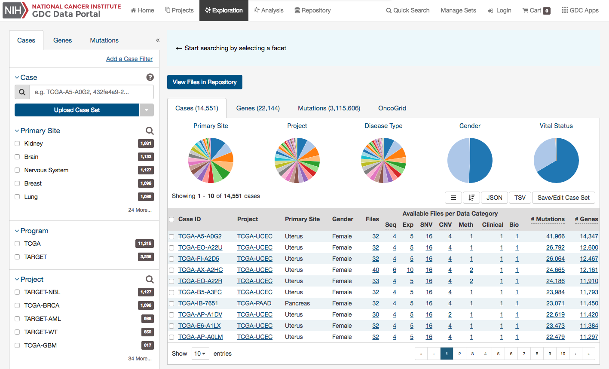
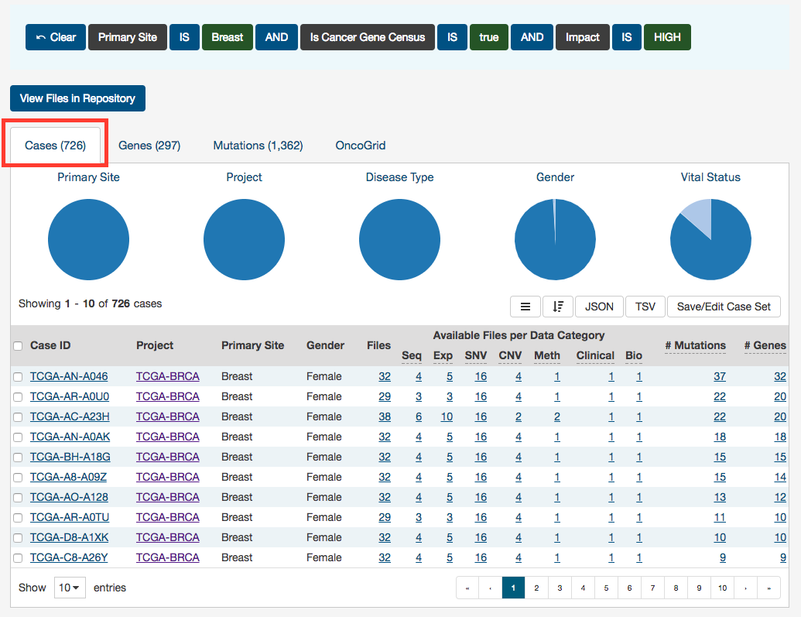
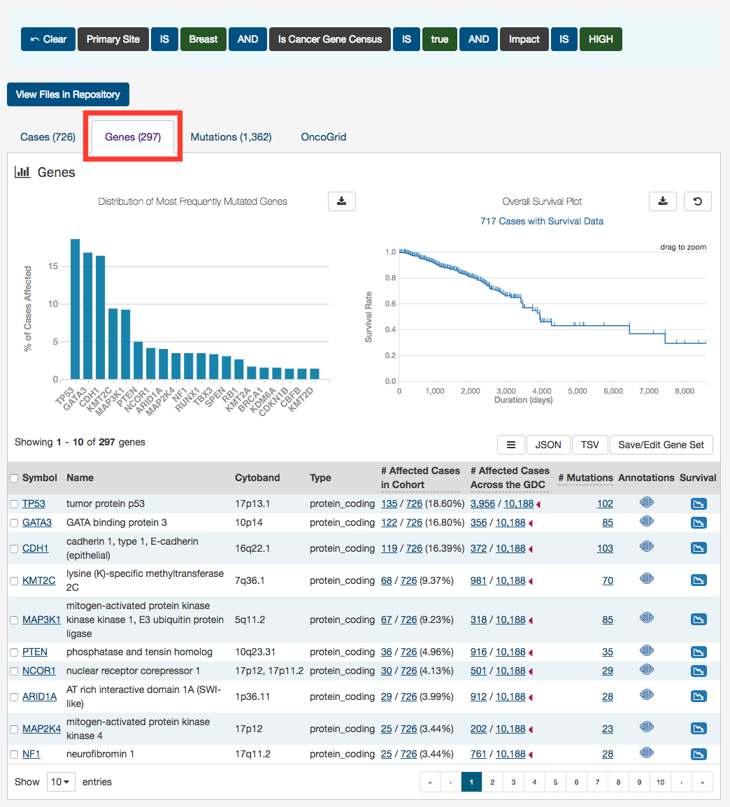
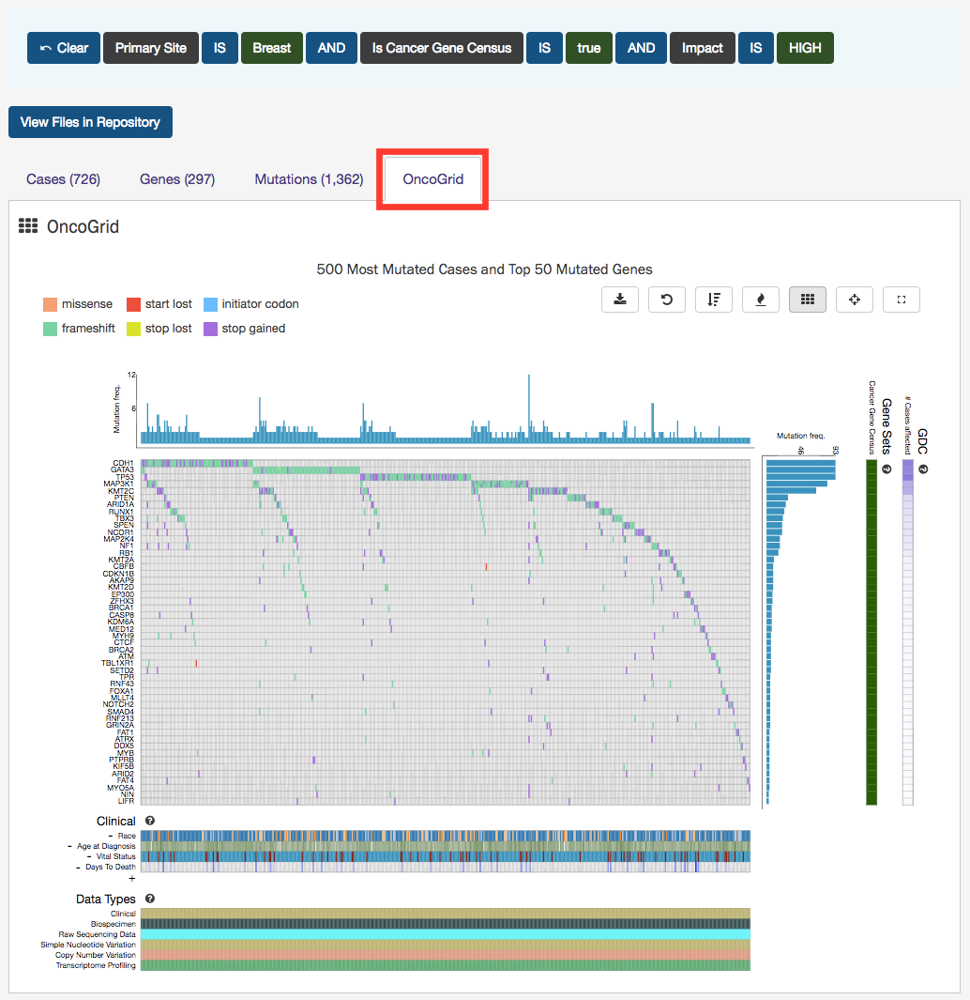

# Exploration

The Exploration page allows users to explore data for cases in the GDC on a gene and mutation level.  Users choose filters on specific Cases, Genes, and/or Mutations and then can visualize these results on the right.

## Filters
On the left of this page, users can create advanced filters to narrow down results to specific genes or mutations that may be present.

### Case Filters

The first tab of filters is for cases in the GDC.

These criteria limit the results only to specific cases within the GDC. The default filters available are:

* __Case ID__ - Specific UUID
* __Case Submitter ID__ - i.e. TCGA Barcode
* __Primary Site__ - Location of the cancer
* __Cancer Program__
* __Project__
* __Disease Type__
* __Primary Site__
* __Gender__
* __Age at Diagnosis__
* __Vital Status__
* __Days to Death__
* __Race__
* __Ethnicity__

In addition to the defaults, users can add additional case filters by clicking on the link titled 'Add a Case Filter'

### Gene Filters

The second tab of filters are for specific genes.  Users can filter by:

* __Gene__ - Entering in a specific Gene Symbol or ID
* __Type__ - Classification of the type of gene
* __Curated Gene Set__ - Whether or not a gene is part of The Cancer Gene Census

### Mutation Filters

The final tab of filters are for specific mutations.  Users can filter by:

* __Mutation ID__ - Unique ID for that mutation.  Users can use the following:
    * UUID - c7c0aeaa-29ed-5a30-a9b6-395ba4133c63
    * DNA Change - 	chr12:g.121804752delC
    * COSMIC ID - COSM202522
* __Impact__ - A subjective classification of the severity of the variant consequence. The categories are:
    * __HIGH__: The variant is assumed to have high (disruptive) impact in the protein, probably causing protein truncation, loss of function, or triggering nonsense mediated decay
    * __MODERATE__: A non-disruptive variant that might change protein effectiveness
    * __LOW__: Assumed to be mostly harmless or unlikely to change protein behavior
* __Consequence Type__ - Consequence type of this variation; [sequence ontology](http://www.sequenceontology.org/) terms
* __Mutation Type__ - The type of mutation
* __SSM Caller__ - The variant caller used to identify the mutation

## Results

As users add filters to the data on the Exploration Page, the Results section will automatically be updated.  Results are broken up into different tabs:  Cases, Genes, Mutations, and OncoGrid.  

To illustrate these tabs, Case, Gene, and Mutation filters have been chosen ( Genes in the Cancer Gene Census, that have HIGH Impact for the TCGA-BRCA project) and a description of what each tab displays follows.

#### Cases

The Cases tab will give an overview of all the cases/patients who correspond to the filters chosen (Cohort).

The top of this section contains a few pie graphs with categorical information regarding the Primary Site, Project, Disease Type, Gender, and Vital Status.

Below these pie charts is a tabular view (which can be exported and sorted using the buttons on the right) of the cases affected, which includes the following information:

* __Case UUID:__ The UUID of the case/patient
* __Submitter ID:__ The submitter ID of that case/patient (i.e. TCGA Barcode)
* __Project:__ The study name for the project for which the case belongs
* __Primary Site:__ The primary site of the cancer/project
* __Gender:__ The gender of the case
* __Files:__ The total number of files available for that case
* __Available Files per Data Category:__ Five columns displaying the number of files available in each of the five data categories.  These link to the files for the specific case.
* __# Mutations:__ The number of SSMs (simple somatic mutations) detected in that case

#### Genes

The Genes tab will give an overview of all the genes who match the criteria of the filters (Cohort).

The top of this section contains a survival plot of all the cases within the specified exploration page search, in addition to a bar graph of the most frequently mutated genes. Hovering over each bar in the plot will display information about the percentage of cases affected. Users may choose to download the underlying data in JSON or TSV format or an image of the graph in SVG or PNG format by clicking the `download` icon at the top of each graph.

Below these graphs is a tabular view of the genes affected, which includes the following information:

* __Symbol:__ The gene symbol, which links to the Gene Summary Page
* __Name:__ Full name of the gene
* __Cytoband:__ The location of the mutation on the chromosome in terms of Giemsa-stained samples.
* __Type:__ The type of gene
* __# Affected Cases in Cohort:__ The number of cases affected in the Cohort
* __# Affected Cases Across all Projects:__ The number of cases within all the projects in the GDC that contain a mutation on this gene.  Clicking the red arrow will display the cases broken down by project
* __# Mutations:__ The number of SSMs (simple somatic mutations) detected in that gene
* __Annotations:__ Includes a COSMIC symbol if the gene belongs to [The Cancer Gene Census](http://cancer.sanger.ac.uk/census/)
* __Survival Analysis:__ An icon that, when clicked, will plot the survival rate between cases in the project with mutated and non-mutated forms of the gene

#### Mutations

The Genes tab will give an overview of all the mutations who match the criteria of the filters (Cohort).

At the top of this tab is a bar graph of the 20 most frequent mutations in the cohort as a bar graph that indicates the percentage of cases that are affected by each mutation. Hovering over each bar in the plot will show information about the number of cases affected.  It also includes a survival plot of all the cases within the specified exploration page filters.

A table is displayed below that lists information about each mutation:

* __ID:__ A UUID for the mutation assigned by the GDC, when clicked will bring a user to the Mutation Summary Page
* __DNA Change:__ The chromosome and starting coordinates of the mutation are displayed along with the nucleotide differences between the reference and tumor allele
* __Type:__ A general classification of the mutation
* __Consequences:__ The effects the mutation has on the gene coding for a protein (i.e. synonymous, missense, non-coding transcript).  A link to the Gene Summary Page for the gene affected by the mutation is included
* __# Affected Cases in Cohort:__ The number of affected cases in the Cohort
* __# Affected Cases in Across all Projects:__ The number of affected cases, expressed as number across all projects. Choosing the arrow next to the percentage will display a breakdown of each affected project
* __Impact:__ A subjective classification of the severity of the variant consequence. The categories are:
    * __HIGH__: The variant is assumed to have high (disruptive) impact in the protein, probably causing protein truncation, loss of function, or triggering nonsense mediated decay
    * __MODERATE__: A non-disruptive variant that might change protein effectiveness
    * __LOW__: Assumed to be mostly harmless or unlikely to change protein behavior
* __Survival Analysis:__ An icon that when clicked, will plot the survival rate between the gene's mutated and non-mutated cases

#### OncoGrid

The Exploration page includes an OncoGrid plot of the cases with the most mutations, for the top 50 mutated genes affected by high impact mutations. Genes displayed on the left of the grid (Y-axis) correspond to individual cases on the bottom of the grid (X-axis).  

The grid is color-coded with a legend at the top left which describes what type of mutation consequence is observed for each gene/case combination. Clinical information and the available data for each case are available at the bottom of the grid.

The right side of the grid displays additional information about the genes:

* __Gene Sets:__ Describes whether a gene is part of [The Cancer Gene Census](http://cancer.sanger.ac.uk/census/).  (The Cancer Gene Census is an ongoing effort to catalogue those genes for which mutations have been causally implicated in cancer)
* __GDC:__ Heat-map of all cases in the GDC affected with a mutation in this gene

### OncoGrid Options

To facilitate readability and comparisons, drag-and-drop can be used to reorder the gene rows.  Double clicking a row in the "# Cases Affected" bar at the right side of the graphic will bring the user to the respective Gene Summary Page page. Hovering over a cell will display information about the mutation such as its ID, affected case, and biological consequence. Clicking on the cell will bring the user to the respective Mutation Summary page.  

A tool bar at the top right of the graphic allows the user to export the data as a JSON object, PNG image, or SVG image.  Seven buttons are available in this toolbar:

* __Download:__ Users can choose to export the contents either to a static image file (PNG or SVG format) or the underlying data in JSON format
* __Refresh:__ Sets all OncoGrid rows, columns, and zoom levels back to their initial positions
* __Cluster Data:__ Clusters the rows and columns to place mutated genes with the same cases and cases with the same mutated genes together
* __Toggle Heatmap:__ The view can be toggled between cells representing mutation consequences or number of mutations in each gene
* __Toggle Gridlines:__ Turn the gridlines on and off
* __Toggle Crosshairs:__ Turns crosshairs on, so that users can zoom into specific sections of the OncoGrid
* __Fullscreen:__ Turns Fullscreen mode on/off
