# Exploration

The Exploration Page allows users to explore data in the GDC using advanced filters/facets, which includes those on a gene and mutation level. Users choose filters on specific `Cases`, `Genes`, and/or `Mutations` on the left of this page and then can visualize these results on the right.  The Gene/Mutation data for these visualizations comes from the Open-Access MAF files on the GDC Data Portal.

## Filters / Facets
On the left of this page, users can create advanced filters to narrow down results to create synthetic cohorts.

### Case Filters

The first tab of filters is for cases in the GDC.

[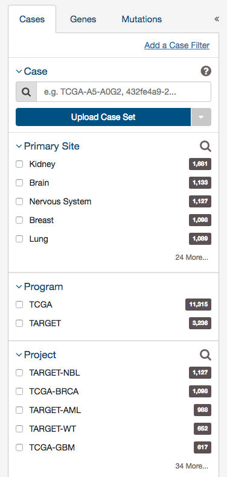](images/Exploration-Cases-Filter.png "Click to see the full image.")

These criteria limit the results only to specific cases within the GDC. The default filters available are:

* __Case:__ Specify individual cases using submitter ID (barcode), UUID, or list of Cases ('Case Set').
* __Primary Site:__ Anatomical site of the cancer under investigation or review.
* __Program:__ A cancer research program, typically consisting of multiple focused projects.
* __Project:__ A cancer research project, typically part of a larger cancer research program.
* __Disease Type:__ Type of cancer studied.
* __Gender:__ Gender of the patient.
* __Age at Diagnosis:__ Patient age at the time of diagnosis.
* __Vital Status:__ Indicator of whether the patient was living or deceased at the date of last contact.
* __Days to Death:__ Number of days from date of diagnosis to death of the patient.
* __Race:__ Race of the patient.
* __Ethnicity:__ Ethnicity of the patient.

In addition to the defaults, users can add additional case filters by clicking on the link titled ["Add a Case Filter"](Repository.md#adding-custom-facets).

### Gene Filters

The second tab of filters is for genes affected by mutations in the GDC.

The second tab of filters are for specific genes.  Users can filter by:

* __Gene:__ Specify a Gene Symbol, ID, or list of Genes ('Gene Set').
* __Biotype:__  Classification of the type of gene according to Ensembl. The biotypes can be grouped into protein coding, pseudogene, long noncoding and short noncoding. Examples of biotypes in each group are as follows:
    * __Protein coding:__ IGC gene, IGD gene, IG gene, IGJ gene, IGLV gene, IGM gene, IGV gene, IGZ gene, nonsense mediated decay, nontranslating CDS, non stop decay, polymorphic pseudogene, TRC gene, TRD gene, TRJ gene, TRV gene.
    * __Pseudogene:__ disrupted domain, IGC pseudogene, IGJ pseudogene, IG pseudogene, IGV pseudogene, processed pseudogene, transcribed processed pseudogene, transcribed unitary pseudogene, transcribed unprocessed pseudogene, translated processed pseudogene, translated unprocessed pseudogene, TRJ pseudogene, TRV pseudogene, unprocessed pseudogene.
    * __Long noncoding:__ 3 prime overlapping ncrna, ambiguous orf, antisense, antisense RNA, lincRNA, macro lincRNA, ncrna host, processed transcript, sense intronic, sense overlapping.
    * __Short noncoding:__ miRNA, miRNA pseudogene, miscRNA, miscRNA pseudogene, Mt rRNA, Mt tRNA, rRNA, scRNA, snlRNA, snoRNA, snRNA, tRNA, tRNA pseudogene, vaultRNA.
* __Is Cancer Gene Census:__ Whether or not a gene is part of [The Cancer Gene Census](http://cancer.sanger.ac.uk/census/).

### Mutation Filters

The final tab of filters is for specific mutations.

[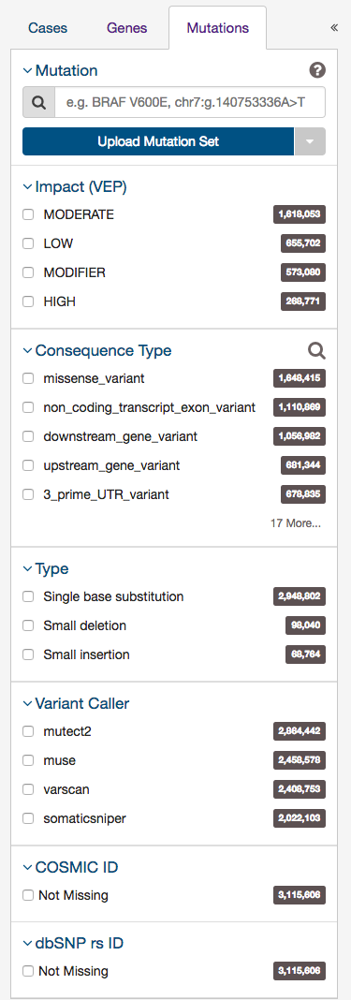](images/Exploration-Mutations-Filter.png "Click to see the full image.")

Users can filter by:

* __Mutation:__  Unique ID for that mutation.  Users can use the following:
    * UUID - c7c0aeaa-29ed-5a30-a9b6-395ba4133c63
    * DNA Change - 	chr12:g.121804752delC
    * COSMIC ID - COSM202522
    * List of any mutation UUIDs or DNA Change id's ('Mutation Set').
* __Consequence Type:__  Consequence type of this variation; [sequence ontology](http://www.sequenceontology.org/) terms.
* __Impact:__ A subjective classification of the severity of the variant consequence. These scores are determined using the three following tools:
    * __[Ensembl VEP](http://useast.ensembl.org/info/genome/variation/prediction/index.html):__
        * __HIGH (H):__ The variant is assumed to have high (disruptive) impact in the protein, probably causing protein truncation, loss of function or triggering nonsense mediated decay.
        * __MODERATE (M):__ A non-disruptive variant that might change protein effectiveness.
        * __LOW (L):__ Assumed to be mostly harmless or unlikely to change protein behavior.
        * __MODIFIER (MO):__ Usually non-coding variants or variants affecting non-coding genes, where predictions are difficult or there is no evidence of impact.
    * __[PolyPhen](http://genetics.bwh.harvard.edu/pph/):__
        * __probably damaging (PR):__ It is with high confidence supposed to affect protein function or structure.
        * __possibly damaging (PO):__ It is supposed to affect protein function or structure.
        * __benign (BE):__ Most likely lacking any phenotypic effect.
        * __unknown (UN):__ When in some rare cases, the lack of data does not allow PolyPhen to make a prediction.
    * __[SIFT](http://sift.jcvi.org/):__
        * __tolerated:__ Not likely to have a phenotypic effect.
        * __tolerated_low_confidence:__ More likely to have a phenotypic effect than 'tolerated'.
        * __deleterious:__ Likely to have a phenotypic effect.
        * __deleterious_low_confidence:__ Less likely to have a phenotypic effect than 'deleterious'.
* __Type:__ A general classification of the mutation.
* __Variant Caller:__ The variant caller used to identify the mutation.
* __COSMIC ID:__ This option will filter out only mutations with a COSMIC ID.
* __dbSNP rs ID:__ This option will filter out only mutations with a SNP identifer maintained in dbSNP.

## Results

As users add filters to the data on the Exploration Page, the Results section will automatically be updated.  Results are divided into different tabs:  `Cases`, `Genes`, `Mutations`, and `OncoGrid`.  

To illustrate these tabs, Case, Gene, and Mutation filters have been chosen (Genes in the Cancer Gene Census, that have a missense variant for the TCGA-BRCA project) and a description of what each tab displays follows.

### Cases

The `Cases` tab gives an overview of all the cases/patients who correspond to the filters chosen (Cohort).

[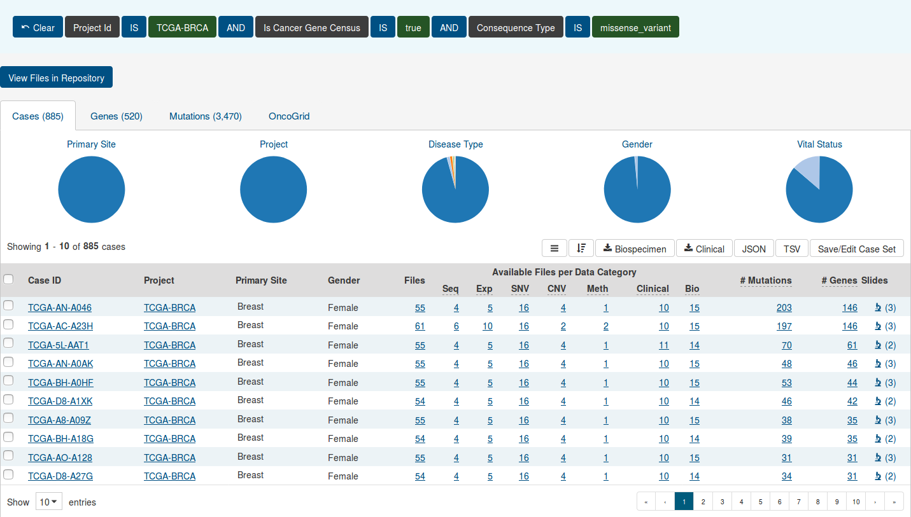](images/Exploration-Case-Example_v2.png "Click to see the full image.")

The top of this section contains a few pie graphs with categorical information regarding the Primary Site, Project, Disease Type, Gender, and Vital Status.

Below these pie charts is a tabular view of cases, which can be exported, sorted and saved using the buttons on the right and includes the following information:

* __Case ID (Submitter ID):__ The Case ID / submitter ID of that case/patient (i.e. TCGA Barcode).
* __Project:__ The study name for the project for which the case belongs.
* __Primary Site:__ The primary site of the cancer/project.
* __Gender:__ The gender of the case.
* __Files:__ The total number of files available for that case.
* __Available Files per Data Category:__ Seven columns displaying the number of files available in each of the seven data categories.  These link to the files for the specific case.
* __# Mutations:__ The number of SSMs (simple somatic mutations) detected in that case.
* __# Genes:__ The number of genes affected by mutations in that case.
* __Slides:__ The total number of slides available for that case. For more information about [slide images](Repository.md#image-viewer-features).

>__Note__: By default, the UUID is not displayed on summary page tables. You can display the UUID by clicking on the icon with 3 parallel lines and checking the UUID option.

### Case Summary Page

The Case Summary Page displays case details including the project and disease information, data files that are available for that case, and the experimental strategies employed. A button in the top-right corner of the page allows the user to add all files associated with the case to the file [cart](Cart.md).

#### Clinical and Biospecimen Information

The page also provides clinical and biospecimen information about that case. Links to export clinical and biospecimen information in JSON format are provided.

For clinical records that support multiple records of the same type (Diagnoses, Family Histories, or Exposures), a UUID of the record is provided at the top of the corresponding tab.

#### Biospecimen Search

A search filter just below the biospecimen section can be used to find and filter biospecimen data. The wildcard search will highlight entities in the tree that match the characters typed. This will search both the case submitter ID, as well as the additional metadata for each entity. For example, searching 'Primary Tumor' will highlight samples that match that type.

[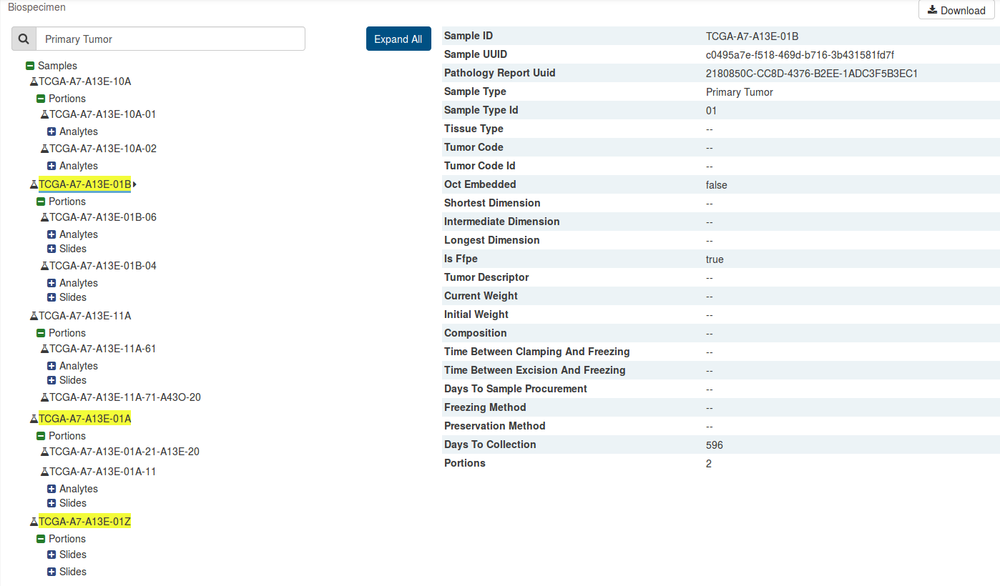](images/gdc_case_biospecimen_search_v3.png "Click to see the full image.")

#### Most Frequent Somatic Mutations for a Case

The Case Entity Page also lists the mutations found in that particular case.

For more information, please go to the [Most Frequent Somatic Mutation](#most-frequent-somatic-mutations) section.

### Genes

The `Genes` tab will give an overview of all the genes that match the criteria of the filters (Cohort).

[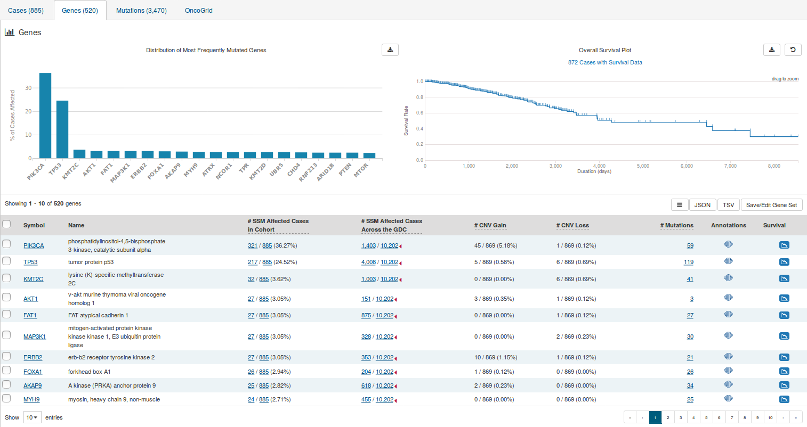](images/Exploration-Gene-Example2.png "Click to see the full image.")

The top of this tab contains a bar graph of the most frequently mutated genes. Hovering over each bar in the plot will display information about the percentage of cases affected. In addition, this section contains a survival curve. The survival curve is calculated using the Kaplan-Meier estimator based on all cases with survival data within the specified Exploration Page search. For more information on how these values are determined, please go to the [Survival Analysis](#survival-analysis) section. Users may choose to download the underlying data in JSON or TSV format or an image of the graph in SVG or PNG format by clicking the `download` icon at the top of each graph.

Below these graphs is a tabular view of the genes affected, which includes the following information:

* __Symbol:__ The gene symbol, which links to the Gene Summary Page.
* __Name:__ Full name of the gene.
* __# SSM Affected Cases in Cohort:__ The number of cases affected by SSMs (simple somatic mutations) in the Cohort.
* __# SSM Affected Cases Across the GDC:__ The number of cases within all the projects in the GDC that contain a mutation on this gene.  Clicking the red arrow will display the cases broken down by project.
* __# CNV Gain:__ The number of CNV (copy number variation) events detected in that gene which resulted in an increase (gain) in the gene's copy number.
* __# CNV Loss:__ The number of CNV events detected in that gene which resulted in a decrease (loss) in the gene's copy number.
* __# Mutations:__ The number of SSMs (simple somatic mutations) detected in that gene.
* __Annotations:__ Includes a COSMIC symbol if the gene belongs to [The Cancer Gene Census](http://cancer.sanger.ac.uk/census/).
* __Survival:__ An icon that, when clicked, will plot the survival rate between cases in the project with mutated and non-mutated forms of the gene.

### Gene Summary Page

Gene Summary Pages describe each gene with mutation data and provides results related to the analyses that are performed on these genes.  

The summary section of the Gene Page contains the following information:

* __Symbol:__ The gene symbol.
* __Name:__ Full name of the gene.
* __Synonyms:__ Synonyms of the gene name or symbol, if available.
* __Type:__ A broad classification of the gene.
* __Location:__ The chromosome on which the gene is located and its coordinates.
* __Strand:__ If the gene is located on the forward (+) or reverse (-) strand.
* __Description:__ A description of gene function and downstream consequences of gene alteration.
- __Annotation:__ A notation/link that states whether the gene is part of [The Cancer Gene Census](http://cancer.sanger.ac.uk/census/).

#### External References

A list with links that lead to external databases with additional information about each gene is displayed here. These external databases include:

*  [Entrez](https://www.ncbi.nlm.nih.gov/gquery/)
*  [Uniprot](http://www.uniprot.org/)
*  [Hugo Gene Nomenclature Committee](http://www.genenames.org/)
*  [Online Mendelian Inheritance in Man](https://www.omim.org/)
*  [Ensembl](http://may2015.archive.ensembl.org/index.html)

#### Cancer Distribution

A table and two bar graphs show how many cases are affected by mutations and copy number variation within the gene as a ratio and percentage. Each row/bar represents the number of cases for each project.  The final column in the table lists the number of unique mutations observed on the gene for each project.

[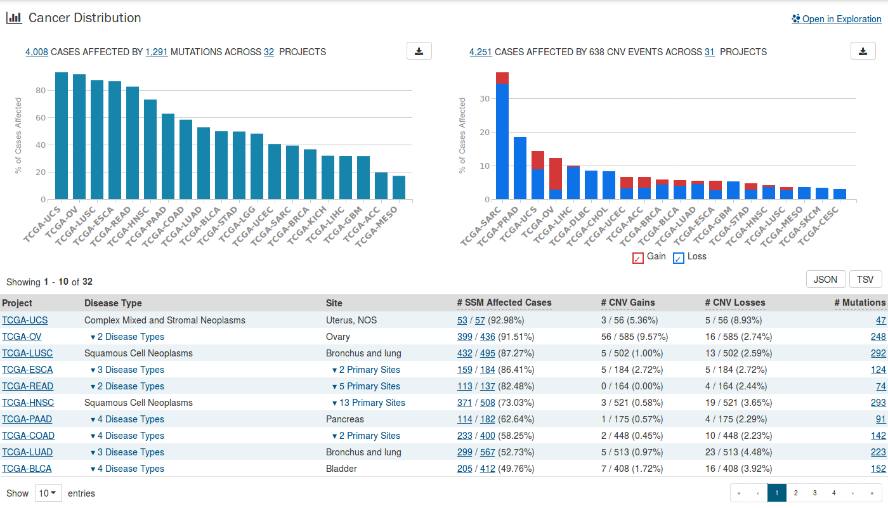](images/GDC-Gene-CancerDist.png "Click to see the full image.")

#### Protein Viewer

Mutations and their frequency across cases are mapped to a graphical visualization of protein-coding regions with a lollipop plot. Pfam domains are highlighted along the x-axis to assign functionality to specific protein-coding regions. The bottom track represents a view of the full gene length. Different transcripts can be selected by using the drop-down menu above the plot.  

The panel to the right of the plot allows the plot to be filtered by mutation consequences or impact. The plot will dynamically change as filters are applied.  Mutation consequence and impact is denoted in the plot by color.

>__Note__: The impact filter on this panel will not display the annotations for alternate transcripts.

The plot can be viewed at different zoom levels by clicking and dragging across the x-axis, clicking and dragging across the bottom track, or double clicking the pfam domain IDs. The `Reset` button can be used to bring the zoom level back to its original position. The plot can also be exported as a PNG image, SVG image or as JSON formatted text by choosing the `Download` button above the plot.

#### Most Frequent Somatic Mutations

The 20 most frequent mutations in the gene are displayed as a bar graph that indicates the number of cases that share each mutation.  

A table is displayed below that lists information about each mutation including:

* __DNA Change:__ The chromosome and starting coordinates of the mutation are displayed along with the nucleotide differences between the reference and tumor allele.
* __Type:__ A general classification of the mutation.
* __Consequences:__ The effects the mutation has on the gene coding for a protein (i.e. synonymous, missense, non-coding transcript).
* __# Affected Cases in Gene:__ The number of affected cases, expressed as number across all mutations within the selected Gene.
* __# Affected Cases Across GDC:__ The number of affected cases, expressed as number across all projects. Choosing the arrow next to the percentage will expand the selection with a breakdown of each affected project.
* __Impact:__  A [subjective classification](#mutation-filters) of the severity of the variant consequence. This is determined by three different tools:
    * __[Ensembl VEP](http://useast.ensembl.org/info/genome/variation/prediction/index.html)__
    * __[PolyPhen](http://genetics.bwh.harvard.edu/pph/)__
    * __[SIFT](http://sift.jcvi.org/)__

Clicking the `Open in Exploration` button will navigate the user to the Exploration Page, showing the same results in the table (mutations filtered by the gene).

### Mutations

The `Mutations` tab will give an overview of all the mutations that match the criteria of the filters (Cohort).

[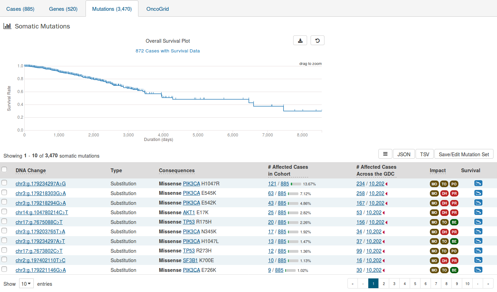](images/Exploration-Mutation-Example.png "Click to see the full image.")

At the top of this tab contains a survival curve. The survival curve is calculated using the Kaplan-Meier estimator based on all cases with survival data within the specified Exploration Page search. For more information on how these values are determined, please go to the [Survival Analysis](#survival-analysis) section. Users may choose to download the underlying data in JSON or TSV format or an image of the graph in SVG or PNG format by clicking the `download` icon at the top of the graph.

A table is displayed below that lists information about each mutation:

* __DNA Change:__ The chromosome and starting coordinates of the mutation are displayed along with the nucleotide differences between the reference and tumor allele.
* __Type:__ A general classification of the mutation.
* __Consequences:__ The effects the mutation has on the gene coding for a protein (i.e. synonymous, missense, non-coding transcript).  A link to the [Gene Summary Page](Exploration.md#gene-summary-page) for the gene affected by the mutation is included.
* __# Affected Cases in Cohort:__ The number of affected cases in the Cohort as a fraction and as a percentage.
* __# Affected Cases in Across all Projects:__ The number of affected cases, expressed as number across all projects. Clicking the arrow next to the percentage will display a breakdown of each affected project.
* __Impact:__  A [subjective classification](#mutation-filters) of the severity of the variant consequence. This is determined by three different tools:
    * __[Ensembl VEP](http://useast.ensembl.org/info/genome/variation/prediction/index.html)__
    * __[PolyPhen](http://genetics.bwh.harvard.edu/pph/)__
    * __[SIFT](http://sift.jcvi.org/)__
* __Survival:__ An icon that when clicked, will plot the survival rate between the gene's mutated and non-mutated cases.

### Mutation Summary Page

  The Mutation Summary Page contains information about one somatic mutation and how it affects the associated gene. Each mutation is identified by its chromosomal position and nucleotide-level change.

  

  - __UUID:__ A unique identifier (UUID) for this mutation.
  - __DNA Change:__ Denotes the chromosome number, position, and nucleotide change of the mutation.
  - __Type:__ A broad categorization of the mutation.
  - __Reference Genome Assembly:__ The reference genome in which the chromosomal position refers to.
  - __Allele in the Reference Assembly:__ The nucleotide(s) that compose the site in the reference assembly.
  - __Functional Impact:__ A subjective classification of the severity of the variant consequence.

#### External References

  A separate panel contains links to databases that contain information about the specific mutation. These include [dbSNP](https://www.ncbi.nlm.nih.gov/projects/SNP/) and [COSMIC](http://cancer.sanger.ac.uk/cosmic).

#### Consequences

The consequences of the mutation are displayed in a table.  The set of consequence terms, defined by the [Sequence Ontology](http://www.sequenceontology.org).

  

The fields that describe each consequence are listed below:

  * __Gene:__ The symbol for the affected gene.
  * __AA Change:__ Details on the amino acid change, including compounds and position, if applicable.
  * __Consequence:__ The biological consequence of each mutation.
  * __Coding DNA Change:__ The specific nucleotide change and position of the mutation within the gene.
* __Impact:__  A [subjective classification](#mutation-filters) of the severity of the variant consequence. This is determined by three different tools:
    * __[Ensembl VEP](http://useast.ensembl.org/info/genome/variation/prediction/index.html)__
    * __[PolyPhen](http://genetics.bwh.harvard.edu/pph/)__
    * __[SIFT](http://sift.jcvi.org/)__
  * __Strand:__ If the gene is located on the forward (+) or reverse (-) strand.
  * __Transcript(s):__ The transcript(s) affected by the mutation. Each contains a link to the [Ensembl](https://www.ensembl.org) entry for the transcript.

#### Cancer Distribution

A table and bar graph shows how many cases are affected by the particular mutation. Each row/bar represents the number of cases for each project.

  [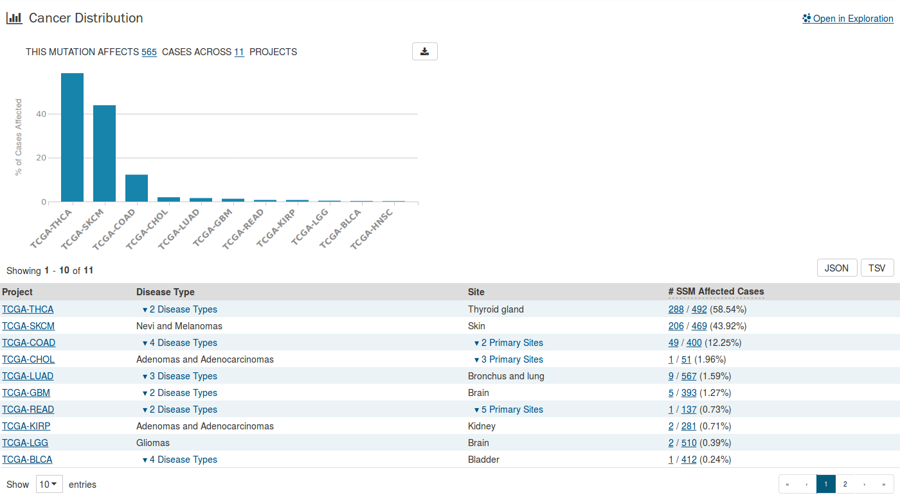](images/GDC-Mutation-CancerDist.png "Click to see the full image.")

The table contains the following fields:

  * __Project ID__: The ID for a specific project.
  * __Disease Type__: The disease associated with the project.
  * __Site__: The anatomical site affected by the disease.
  * __# SMM Affected Cases__: The number of affected cases and total number of cases displayed as a fraction and percentage.

#### Protein Viewer

The protein viewer displays a plot representing the position of mutations along the polypeptide chain. The y-axis represents the number of cases that exhibit each mutation, whereas the x-axis represents the polypeptide chain sequence. [Pfam domains](http://pfam.xfam.org/) that were identified along the polypeptide chain are identified with colored rectangles labeled with pfam IDs. See the [Gene Summary Page](#gene-summary-page) for additional details about the [protein viewer](#protein-viewer).

  

## OncoGrid

The Exploration Page includes an OncoGrid plot of the cases with the most mutations, for the top 50 mutated genes affected by high impact mutations. Genes displayed on the left of the grid (Y-axis) correspond to individual cases on the bottom of the grid (X-axis). Additionally, the plot also indicates in each cell any CNV events detected for these top mutated cases and genes.

[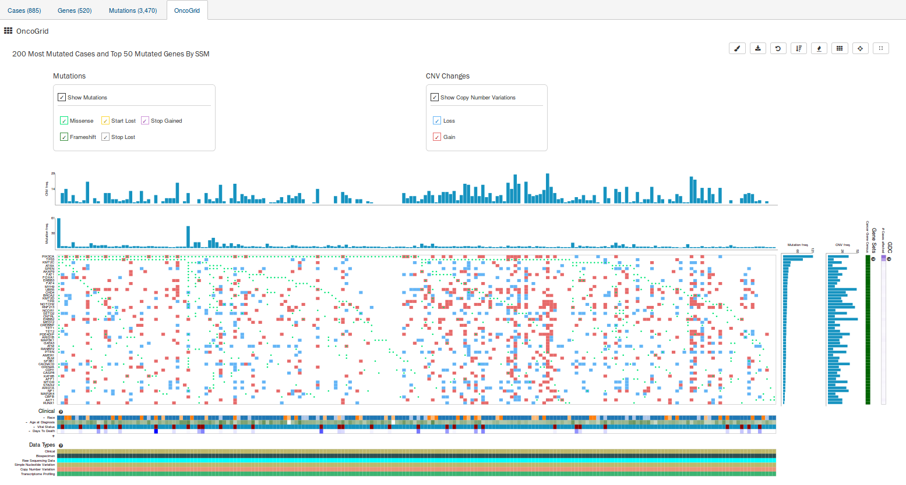](images/Exploration-Oncogrid-Example_v2.png "Click to see the full image.")

The grid is color-coded with a legend at the top which describes what type of mutation consequence and CNV event is observed for each gene/case combination. Clinical information and the available data for each case are available at the bottom of the grid.

The right side of the grid displays additional information about the genes:

* __Gene Sets:__ Describes whether a gene is part of [The Cancer Gene Census](http://cancer.sanger.ac.uk/census/).  (The Cancer Gene Census is an ongoing effort to catalogue those genes for which mutations have been causally implicated in cancer)
* __# Cases Affected:__ Identifies all cases in the GDC affected with a mutation in this gene

### OncoGrid Options

To facilitate readability and comparisons, drag-and-drop can be used to reorder the gene rows.  Double clicking a row in the "# Cases Affected" bar at the right side of the graphic launches the respective Gene Summary Page. Hovering over a cell will display information about the mutation such as its ID, affected case, and biological consequence. Clicking on the cell will bring the user to the respective Mutation Summary Page.  

A tool bar at the top right of the graphic allows the user to export the data as a JSON object, PNG image, or SVG image.  Seven buttons are available in this toolbar:

* __Customize Colors:__ Users can customize the colors that represent mutation consequence types and CNV gains/losses.
* __Download:__ Users can choose to export the contents either to a static image file (PNG or SVG format) or the underlying data in JSON format.
* __Reload Grid:__ Sets all OncoGrid rows, columns, and zoom levels back to their initial positions.
* __Cluster Data:__ Clusters the rows and columns to place mutated genes with the same cases and cases with the same mutated genes together.
* __Toggle Heatmap:__ The view can be toggled between cells representing mutation consequences or number of mutations in each gene.
* __Toggle Gridlines:__ Turn the gridlines on and off.
* __Toggle Crosshairs:__ Turns crosshairs on, so that users can zoom into specific sections of the OncoGrid.
* __Fullscreen:__ Turns Fullscreen mode on/off.

### OncoGrid Color Picker

To customize the colors for mutation consequence types and CNV gains/losses, a user can click the color picker icon in the OncoGrid toolbar.  

* __Customize Colors:__ Opens a control where the user can pick their own colors or apply a suggested theme and save their changes.
* __Reset to Default:__ Resets all colors to the defaults initially used by OncoGrid.

[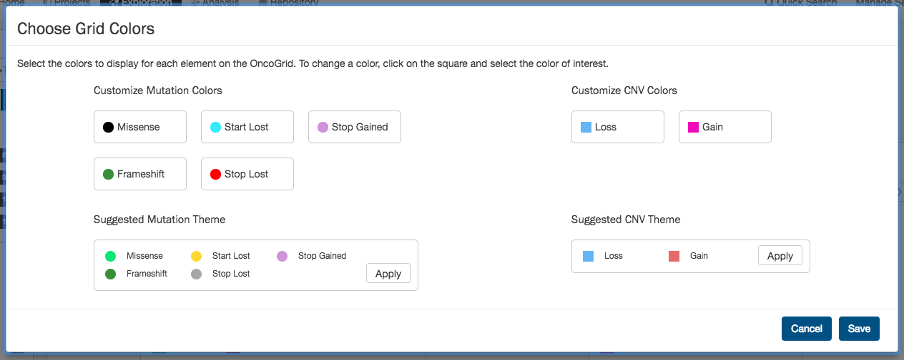](images/Exploration-Oncogrid-Color-Picker.png "Click to see the full image.")

## File Navigation

After utilizing the Exploration Page to narrow down a specific cohort, users can find the specific files that relate to this group by clicking on the `View Files in Repository` button as shown in the image below.

[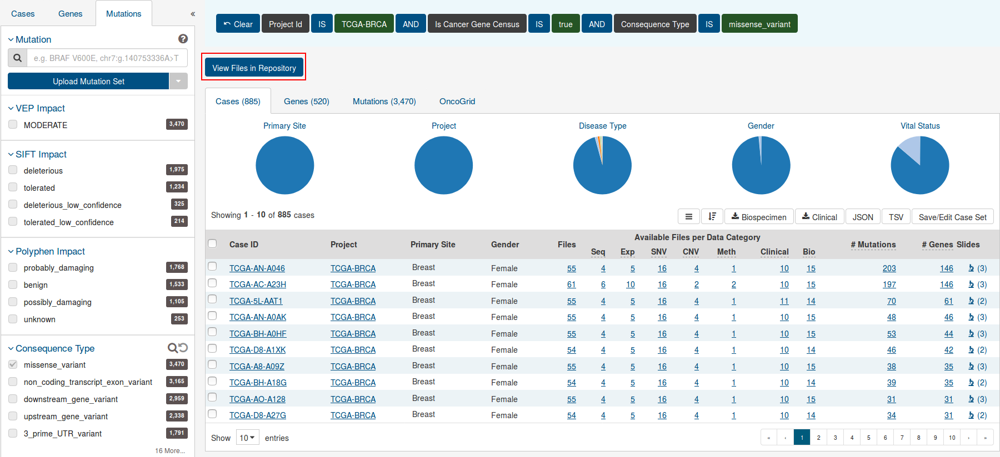](images/Exploration-View-Files_v3.png "Click to see the full image.")

Clicking this button will navigate the users to the Repository Page, filtered by the cases within the cohort.

[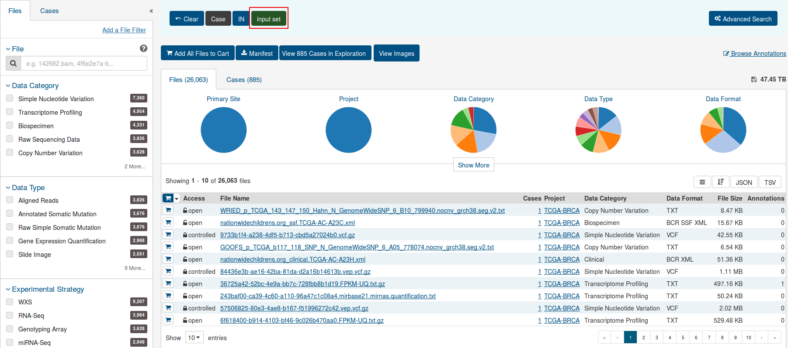](images/gdc-input-set_v2.png "Click to see the full image.")

The filters chosen on the Exploration Page are displayed as an `input set` on the Repository Page.  Additional filters may be added on top of this `input set`, but the original set cannot be modified and instead a new `input set` must be created from original data.  

---

## Survival Analysis

The survival analysis, which is seen in both the `Gene` and `Mutation` tabs, is used to analyze the occurrence of event data over time.  In the GDC, survival analysis is performed on the mortality of the cases. Thus, the values are retrieved from [GDC Data Dictionary](../../../Data_Dictionary) properties and a survival analysis requires the following fields:

*  Data on the time to a particular event (days to death or last follow up).
    * Fields:  __diagnoses.days_to_death__ or __diagnoses.days_to_last_follow_up__
*  Information on whether the event has occurred (alive/deceased).
    * Fields:  __diagnoses.vital_status__
*  Data split into different categories or groups (i.e. gender, etc.).
    * Fields:  __demographic.gender__

The survival analysis in the GDC uses a Kaplan-Meier estimator:

Where:

 * S(t) is the estimated survival probability for any particular one of the t time periods.
 * ni is the number of subjects at risk at the beginning of time period ti.
 * and di is the number of subjects who die during time period ti.

The table below is an example data set to calculate survival for a set of seven cases:

The calculated cumulated survival probability can be plotted against the interval to obtain a survival plot like the one shown below.

