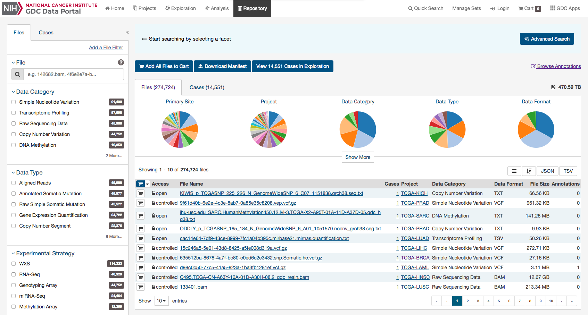
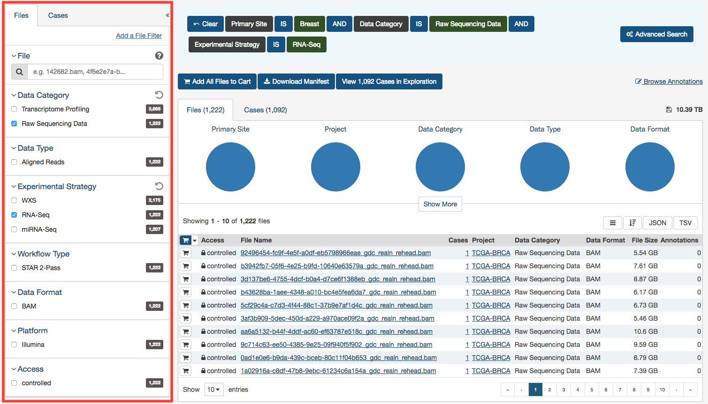
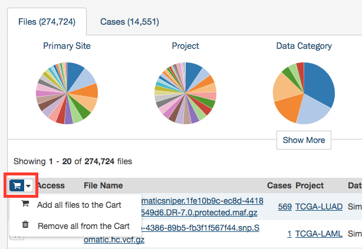
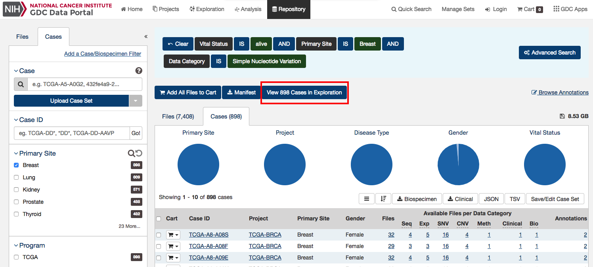
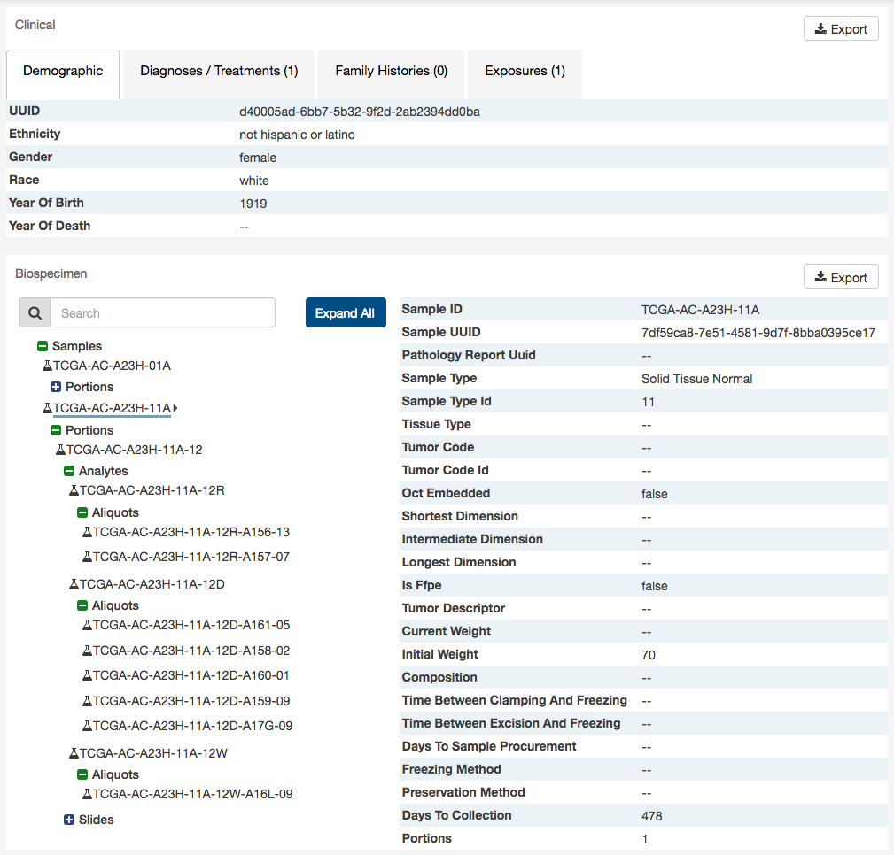
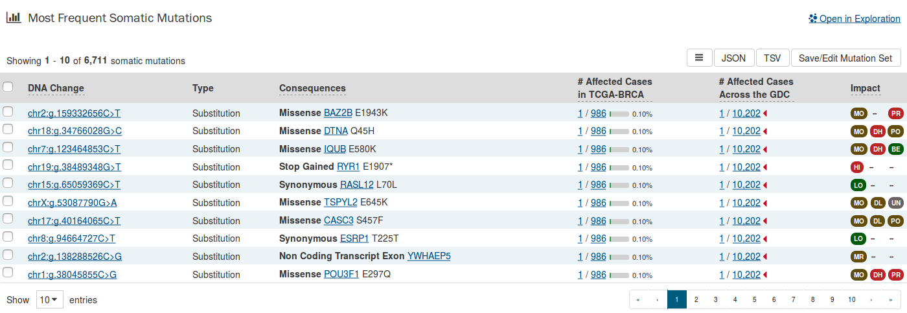

# Repository

## Summary

The Repository Page is the primary method of accessing data in the GDC Data Portal. It provides an overview of all cases and files available in the GDC and offers users a variety of filters for identifying and browsing cases and files of interest. Users can access the Repository Page from the GDC Data Portal front page, from the Data Portal toolbar, or directly at [https://portal.gdc.cancer.gov/repository](https://portal.gdc.cancer.gov/repository).

## Filters / Facets
On the left, a panel of data facets allows users to filter cases and files using a variety of criteria. If facet filters are applied, the tabs on the right will display information about matching cases and files. If no filters are applied, the tabs on the right will display information about all available data.

On the right, two tabs contain information about available data:

* *`Files` tab* provides a list of files, select information about each file, and links to individual file detail pages.
* *`Cases` tab* provides a list of cases, select information about each case, and links to individual case summary pages

The banner above the tabs on the right displays any active facet filters and provides access to advanced search.

The top of the Repository Page contains a few summary pie charts for Primary Sites, Projects, Disease Type, Gender, and Vital Status.  These reflect all available data or, if facet filters are applied, only the data that matches the filters. Clicking on a specific slice in a pie chart, or on a number in a table, applies corresponding facet filters.

### Facets Panel

Facets represent properties of the data that can be used for filtering. The facets panel on the left allows users to filter the cases and files presented in the tabs on the right.

The facets panel is divided into two tabs, with the Files tab containing facets pertaining to data files and experimental strategies, while the Cases tab containing facets pertaining to the cases and biospecimen information. Users can apply filters in both tabs simultaneously. The applied filters will be displayed in the banner above the tabs on the right, with the option to open the filter in [Advanced Search](Advanced_Search.md) to further refine the query.

The [Getting Started](Getting_Started.md#facet-filters) section provides instructions on using facet filters. In the following example, a filter from the Cases tab ("primary site") and filters from the Files tab ("data category", "experimental strategy") are both applied:

The default set of facets is listed below.

*Files* facets tab:

* __File__: Specify individual files using filename or UUID.
* __Data Category__: A high-level data file category, such as "Raw Sequencing Data" or "Transcriptome Profiling".
* __Data Type__: Data file type, such as "Aligned Reads" or "Gene Expression Quantification". Data Type is more granular than Data Category.
* __Experimental Strategy__: Experimental strategies used for molecular characterization of the cancer.
* __Workflow Type__: Bioinformatics workflow used to generate or harmonize the data file.
* __Data Format__: Format of the data file.
* __Platform__: Technological platform on which experimental data was produced.
* __Access Level__: Indicator of whether access to the data file is open or controlled.

*Cases* facets tab:

* __Case__: Specify individual cases using submitter ID (barcode) or UUID.
* __Case Submitter ID Prefix__: Search for cases using a part (prefix) of the submitter ID (barcode).
* __Primary Site__: Anatomical site of the cancer under investigation or review.
* __Cancer Program__: A cancer research program, typically consisting of multiple focused projects.
* __Project__: A cancer research project, typically part of a larger cancer research program.
* __Disease Type__: Type of cancer studied.
* __Gender__: Gender of the patient.
* __Age at Diagnosis__: Patient age at the time of diagnosis.
* __Vital Status__: Indicator of whether the patient was living or deceased at the date of last contact.
* __Days to Death__: Number of days from date of diagnosis to death of the patient.
* __Race__: Race of the patient.
* __Ethnicity__: Ethnicity of the patient.

### Adding Custom Facets

The Repository Page provides access to additional data facets beyond those listed above. Facets corresponding to additional properties listed in the [GDC Data Dictionary](../../Data_Dictionary/index.md) can be added using the "add a filter" links available at the top of the Cases and Files facet tabs:

The links open a search window that allows the user to find an additional facet by name or description. Not all facets have values available for filtering; checking the "Only show fields with values" checkbox will limit the search results to only those that do. Selecting a facet from the list of search results below the search box will add it to the facets panel.

Newly added facets will show up at the top of the facets panel and can be removed individually by clicking on the red cross to the right of the facet name. The default set of facets can be restored by clicking "Reset".

## Results

### Files List

The Files tab on the right provides a list of available files and select information about each file. If facet filters are applied, the list includes only matching files. Otherwise, the list includes all data files available in the GDC Data Portal.

The *File Name* column includes links to [file detail pages](#file-detail-page) where the user can learn more about each file.

Users can add individual file(s) to the file cart using the cart button next to each file. Alternatively, all files that match the current facet filters can be added to the cart using the menu in the top left corner of the table:

### Cases List

The Cases tab on the right provides a list of available cases and select information about each case. If facet filters are applied, the list includes only matching cases. Otherwise, the list includes all cases available in the GDC Data Portal.

The list includes links to [case summary pages](#case-summary-page) in the *Case UUID* column, the Submitter ID (i.e. TCGA Barcode), and counts of the available file types for each case. Clicking on a count will apply facet filters to display the corresponding files.

The list also includes a shopping cart button, allowing the user to add all files associated with a case to the file cart for downloading at a later time:

## Navigation

After utilizing the Repository Page to narrow down a specific set of cases, users can continue to explore the mutations and genes affected by these cases by clicking the `View Files in Repository` button as shown in the image below.

Clicking this button will navigate the users to the Exploration Page, filtered by the cases within the cohort.

## Case Summary Page

The Case Summary page displays case details including the project and disease information, data files that are available for that case, and the experimental strategies employed. A button in the top-right corner of the page allows the user to add all files associated with the case to the file cart.

### Clinical and Biospecimen Information

The page also provides clinical and biospecimen information about that case. Links to export clinical and biospecimen information in JSON format are provided.

For clinical records that support multiple records of the same type (Diagnoses, Family Histories, or Exposures), a UUID of the record is provided on the left hand side of the corresponding tab, allowing the user to select the entry of interest.

### Biospecimen Search

A search filter just below the biospecimen section can be used to find and filter biospecimen data. The wildcard search will highlight entities in the tree that match the characters typed. This will search both the case submitter ID, as well as the additional metadata for each entity. For example, searching 'Primary Tumor' will highlight samples that match that type.

### Most Frequent Somatic Mutations

The case entity page also lists the mutations found in that particular case.

The table lists the following information for each mutation

* __DNA Change:__ The chromosome and starting coordinates of the mutation are displayed along with the nucleotide differences between the reference and tumor allele
* __Type:__ A general classification of the mutation
* __Consequences:__ The effects the mutation has on the gene coding for a protein (i.e. synonymous, missense, non-coding transcript)
* __# Affected Cases in Project:__ The number of affected cases, expressed as number across all mutations within the Project
* __# Affected Cases Across GDC:__ The number of affected cases, expressed as number across all projects. Choosing the arrow next to the percentage will expand the selection with a breakdown of each affected project
* __Impact (VEP):__ A subjective classification of the severity of the variant consequence. This information comes from the [Ensembl VEP](http://www.ensembl.org/info/genome/variation/predicted_data.html). The categories are:
  - __HIGH (H)__: The variant is assumed to have high (disruptive) impact in the protein, probably causing protein truncation, loss of function or triggering nonsense mediated decay
  - __MODERATE (M)__: A non-disruptive variant that might change protein effectiveness
  - __LOW (L)__: Assumed to be mostly harmless or unlikely to change protein behavior
  - __MODIFIER (MO)__: Usually non-coding variants or variants affecting non-coding genes, where predictions are difficult or there is no evidence of impact

Clicking on the `Open in Exploration` button at the top right of this section will navigate the user to the Exploration page, filtered on this case.

## File Summary Page

The File Summary page provides information a data file, including file properties like size, md5 checksum, and data format; information on the type of data included; links to the associated case and biospecimen; and information about how the data file was generated or processed.

The page also includes buttons to download the file, add it to the file cart, or (for BAM files) utilize the BAM slicing function.

In the lower section of the screen, the following tables provide more details about the file and its characteristics:

* __Associated Cases / Biospecimen__: List of Cases or biospecimen the file is directly attached to.
* __Analysis and Reference Genome__: Information on the workflow and reference genome used for file generation.
* __Read Groups__: Information on the read groups associated with the file.
* __Metadata Files__: Experiment metadata, run metadata and analysis metadata associated with the file.
* __Downstream Analysis Files__: List of downstream analysis files generated by the file.
* __File Versions__: List of all versions of the file.

**Note**: *The Legacy Archive* will not display "Workflow, Reference Genome and Read Groups" sections (these sections are applicable to the GDC harmonization pipeline only). However it may provide information on Archives and metadata files like MAGE-TABs and SRA XMLs. For more information, please refer to the section [Legacy Archive](Legacy_Archive.md).

### BAM Slicing

BAM file detail pages have a "BAM Slicing" button. This function allows the user to specify a region of a BAM file for download. Clicking on it will open the BAM slicing window:

During preparation of the slice, the icon on the BAM Slicing button will be spinning, and the file will be offered for download to the user as soon as ready.
