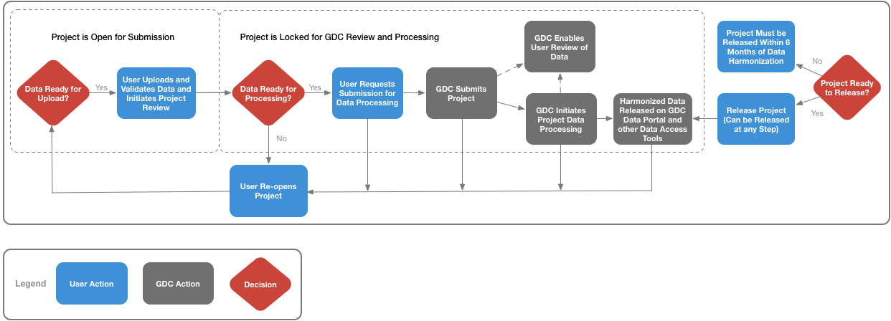

# Data Submission Overview

## Overview
The lifecycle of a project in the GDC describes the workflow throughout the data submission process. The project lifecycle starts with the upload and validation of data into the project and ends with the release of the harmonized data to the [GDC Data Portal](https://portal.gdc.cancer.gov/) and other [GDC Data Access Tools](https://gdc.cancer.gov/access-data/data-access-processes-and-tools). Throughout the lifecycle, the project transitions through various states in which the project is open for uploading data, in review, and processing. This lifecycle is continuous as new project data becomes available.

### Project Lifecycle
The diagram of the project lifecycle below demonstrates the transition of a project through the various states. Initially the project is open for data upload and validation. Any changes to the data must be made while the project status is open. When the data is uploaded and ready for review, the submitter changes the project state to review. During the review state, the project is locked and additional data cannot be uploaded. If data changes are needed during the review period, the project has to be re-opened. 

The process of Harmonization does not occur immediately after submitted files are uploaded. After the submission is complete and all the necessary data and files have been uploaded, the user submits the data to the GDC for processing through the [GDC Data Harmonization Pipelines](https://gdc.cancer.gov/submit-data/gdc-data-harmonization) and the project state changes to submitted. When the data has been processed, the project state changes back to open for new data to be submitted to the project and the submitter can review the processed data. After review of the processed data, the submitter can then release the harmonized data to the [GDC Data Portal](https://portal.gdc.cancer.gov/) and other [GDC Data Access Tools](https://gdc.cancer.gov/access-data/data-access-processes-and-tools) according to [GDC Data Sharing Policies](https://gdc.cancer.gov/submit-data/data-submission-policies). 

### File Lifecycle

This section describes states pertaining to submittable data files throughout the data submission process. A submittable data file could contain data such as genomic sequences (such as a BAM or FASTQ) or pathology slide images. The file lifecycle starts when a submitter uploads metadata for a file to the [GDC Data Submission Portal](https://portal.gdc.cancer.gov/submission/). This metadata file registers a description of the file as an entity on the GDC, the status for this is known as "state" and is represented by __purple__ cirlces. The submitter can then use the [GDC Data Transfer Tool](https://gdc.cancer.gov/access-data/gdc-data-transfer-tool) to upload the actual file, which is represeneted by __red__ circles. Throughout the lifecycle, the file and its associated entity transition through various states from when they are initially registered through file submission and processing. The diagram below details these state transitions.   

