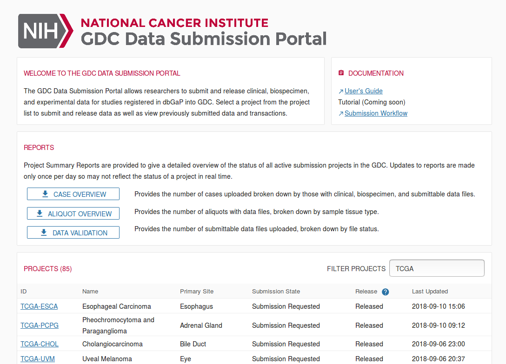
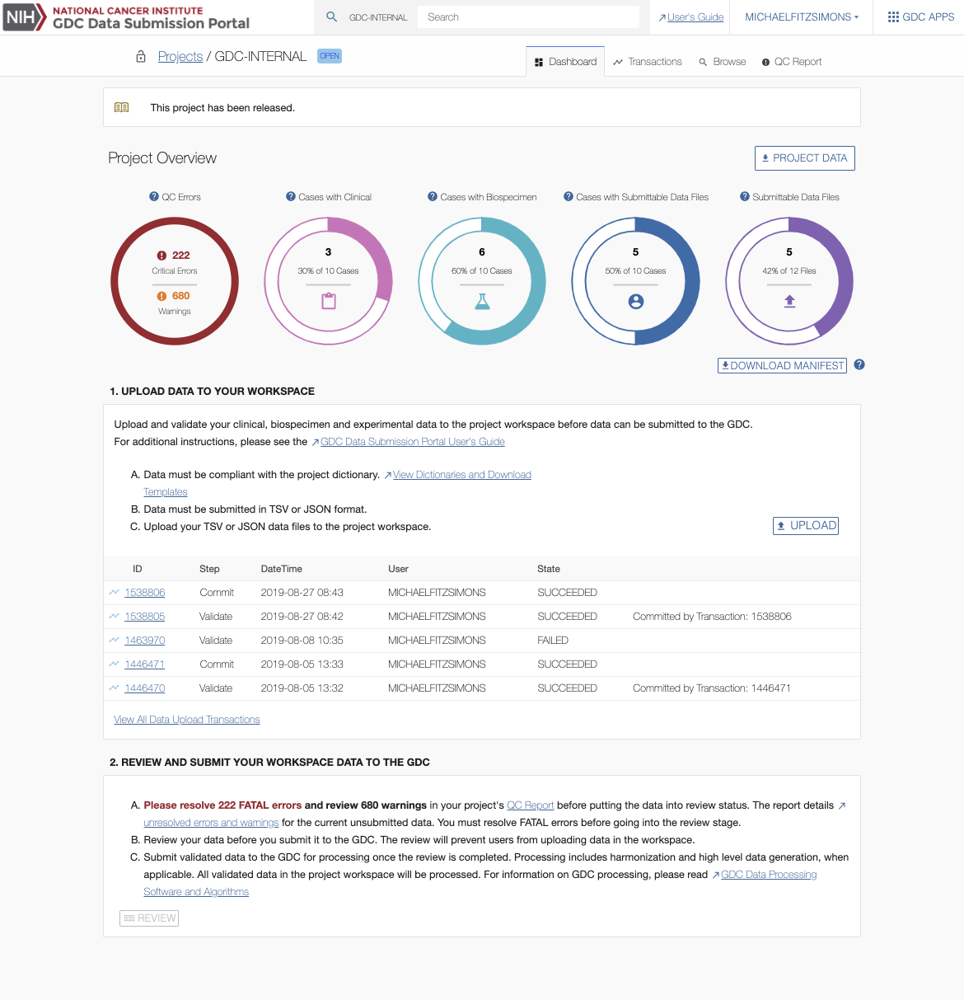
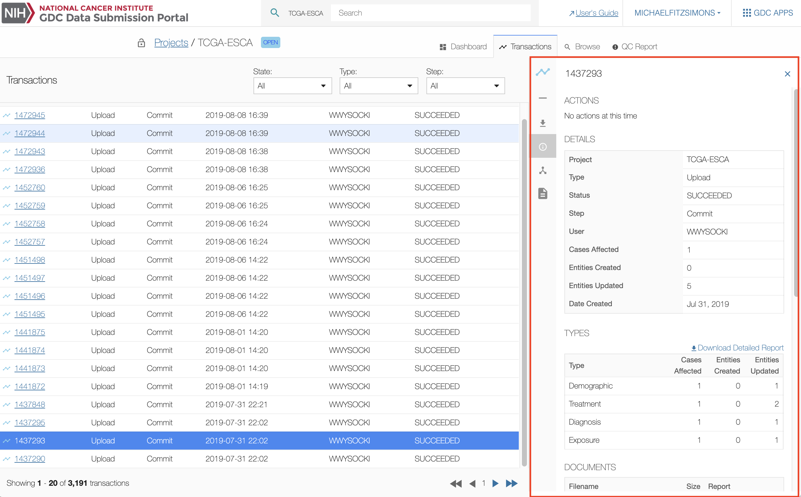
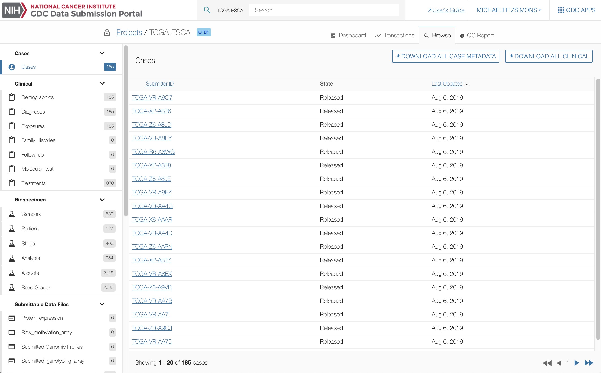
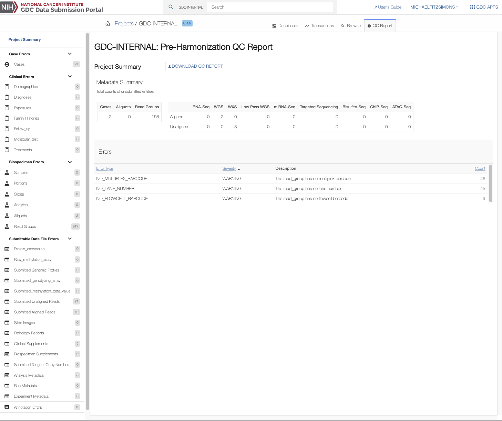
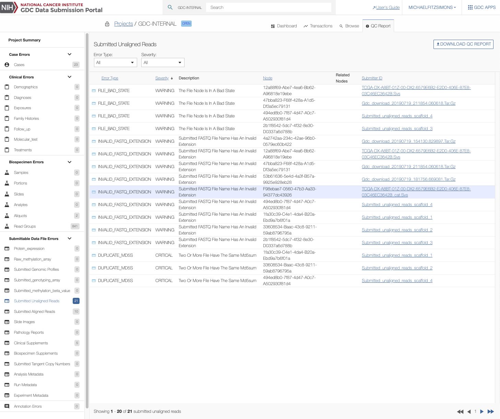

# Data Submission Portal

## Overview

This section will walk users through the submission process using the [GDC Data Submission Portal](https://portal.gdc.cancer.gov/submission/) to upload files to the GDC.

## Authentication

### Requirements

Accessing the GDC Data Submission Portal requires eRA Commons credentials with appropriate dbGaP authorization.  To learn more about obtaining the required credentials and authorization, see [Obtaining Access to Submit Data]( https://gdc.cancer.gov/submit-data/obtaining-access-submit-data).

### Authentication via eRA Commons

Users can log into the GDC Data Submission Portal with eRA Commons credentials by clicking the "Login" button. If authentication is successful, the user will be redirected to the GDC Data Submission Portal front page and the user's eRA Commons username will be displayed in the upper right corner of the screen.

#### GDC Authentication Tokens

The GDC Data Portal provides authentication tokens for use with the GDC Data Transfer Tool or the GDC API. To download a token:

1. Log into the GDC using your eRA Commons credentials.
2. Click the username in the top right corner of the screen.
3. Select the "Download Token" option.

A new token is generated each time the `Download Token` button is clicked.

For more information about authentication tokens, see [Data Security](../../Data/Data_Security/Data_Security.md#authentication-tokens).

>**NOTE:** The authentication token should be kept in a secure location, as it allows access to all data accessible by the associated user account.

#### Logging Out

To log out of the GDC, click the username in the top right corner of the screen, and select the Logout option. Users will automatically be logged out after 15 minutes of inactivity.

## Homepage

After authentication, users are redirected to a homepage. The homepage acts as the entry point for GDC data submission and provides submitters with access to a list of authorized projects, reports, and transactions. Content on the homepage varies based on the user profile (e.g. submitter, program office).

### Reports

Project summary reports can be downloaded at the Submission Portal homepage at three different levels: `CASE OVERVIEW`, `ALIQUOT OVERVIEW`, and `DATA VALIDATION`.  Each report is generated in tab-delimited format in which each row represents an active project.  

* __`CASE OVERVIEW`:__ This report describes the number of cases with associated biospecimen data, clinical data, or submittable data files (broken down by data type) for each project.
* __`ALIQUOT OVERVIEW`:__ This report describes the number of aliquots in a project with associated data files. Aliquot numbers are broken down by sample tissue type.
* __`DATA VALIDATION`:__ This report categorizes all submittable data files associated with a project by their file status.

### Projects

The projects section in the homepage lists the projects that the user has access to along with basic information about each project. For users with access to a large number of projects, this table can be filtered using the 'FILTER PROJECTS' field. Selecting a project ID will direct the user to the project's [Dashboard](#dashboard). The button used to release data for each project is also located on this screen, see [Release](#release) for details.

## Dashboard

The GDC Data Submission Portal dashboard provides details about a specific project.

The dashboard contains various visual elements to guide the user through all stages of submission, from viewing the [Data Dictionary](https://docs.gdc.cancer.gov/Data_Dictionary/), support of data upload, to submitting a project for harmonization.

To better understand the information displayed on the dashboard and the available actions, please refer to the [Data Submission Walkthrough](Data_Submission_Walkthrough.md).

### Project Overview
The Project Overview sections of the dashboard displays the most current project state (open / review / submitted / processing) and the GDC Release, which is the date in which the project was released to the GDC.

The search field at the top of the dashboard allows for submitted entities to be searched by partial or whole `submitter_id`.  When a search term is entered into the field, a list of entities matching the term is updated in real time.  Selecting one of these entities links to its details in the [Browse Tab](#browse).

The remaining part of the top section of the dashboard is broken down into four status charts:

* __QC Errors__: The number of errors found in the uploaded data.  For more details please refer to the [QC Report Section](/Data_Submission_Portal/Users_Guide/Data_Submission_Process/#qc-reports).
* __Cases with Clinical__: The number of `cases` for which Clinical data has been uploaded.
* __Cases with Biospecimen__: The number of `cases` for which Biospecimen data has been uploaded.
* __Cases with Submittable Data Files__: The number of `cases` for which experimental data has been uploaded.
* __Submittable Data Files__: The number of registered submittable data files that have been successfully uploaded through the GDC Data Transfer Tool. Totals do not include files that have been submitted for harmonization. For more information on this status chart, please refer to [File Lifecycle](Data_Submission_Overview.md#file-lifecycle).
    * __`DOWNLOAD MANIFEST`:__ This button below the status chart allows the user to download a manifest for registered files in this project that have not yet been uploaded.

### Action Panels

There are two action panels available below the Project Overview.

* [UPLOAD DATA TO YOUR WORKSPACE](Data_Submission_Walkthrough.md): Allows a submitter to upload project data to the GDC project workspace. The GDC will validate the uploaded data against the [GDC Data Dictionary](https://docs.gdc.cancer.gov/Data_Dictionary/). This panel also contains a table that displays details about the five latest transactions. Clicking the IDs in the first column will bring up a window with details about the transaction, which are documented in the [transactions](#transactions) page. This panel will also allow the user to commit file uploads to the project.
* [REVIEW AND SUBMIT YOUR WORKSPACE DATA TO THE GDC](#submit-your-workspace-data-to-the-gdc): Allows a submitter to review project data which will lock the project to ensure that additional data cannot be uploaded while in review. Once the review is complete, the data can be submitted to the GDC for processing through the [GDC Harmonization Process](https://gdc.cancer.gov/submit-data/gdc-data-harmonization).

These actions and associated features are further detailed in their respective sections of the documentation.

## Transactions

The transactions page lists all of the project's transactions. The transactions page can be accessed by choosing the Transactions tab at the top of the dashboard or by choosing "View All Data Upload Transactions" in the first panel of the dashboard.

The types of transactions are the following:

* __Upload:__ The user uploads data to the project workspace. Note that submittable data files uploaded using the GDC Data Transfer tool do not appear as transactions. Uploaded submittable data can be viewed in the Browse tab.
* __Delete:__ The user deletes data from the project workspace.
* __Review:__ The user reviews the project before submitting data to the GDC.
* __Open:__ The user re-opens the project if it was under review. This allows the upload of new data to the project workspace.
* __Submit:__ The user submits uploaded data to the GDC. This triggers the data harmonization process.
* __Release:__ The user releases harmonized data to be available through the GDC Data Portal and other GDC data access tools.

### Transactions List View

The transactions list view displays the following information:

|Column|Description|
| --- | --- |
| __ID__ | Identifier of the transaction |
| __Type__ | Type of the transaction (see the list of transaction types in the previous section)|
| __Step__ | The step of the submission process that each file is currently in. This can be Validate or Commit. "Validate" represents files that have not yet been committed but have been uploaded using the submission portal or the API. |
| __DateTime__ | Date and Time that the transaction was initiated |
| __User__ | The username of the submitter that performed the transaction |
| __State__ | 	Indicates the status of the transaction: `SUCCEEDED`, `PENDING`, or `FAILED` |
| __Commit/Discard__ | Two buttons appear when data has been uploaded using the API or the submission portal. This allows for validated data to be incorporated into the project or discarded. This column will then display the transaction number for commited uploads and "Discarded" for the uploads that are discarded.|

### Transaction Filters

Choosing from the drop-down menu at the top of the table allows the transactions to be filtered by those that are in progress, to be committed, succeeded, failed, or discarded. The drop-down menu also allows for the transactions to be filtered by type and step.  

### Transactions Details

Clicking on a transaction will open the details panel. Data in this panel is organized into multiple sections including actions, details, types, and documents as described below.

Navigation between the sections can be performed by either scrolling down or by clicking on the section icon displayed on the left side of the details panel.

#### Actions

The Actions section allows a user to perform an action for transactions that provide actions. For example, if a user uploads read groups and file metadata, a corresponding manifest file will be available for download from the transaction. This manifest is used to upload the actual files through the [GDC Data Transfer Tool](https://gdc.cancer.gov/access-data/gdc-data-transfer-tool).

#### Details

The Details section provides details about the transaction itself, such as its project, type, and number of affected cases.

#### Types

The Types section lists the type of files submitted and the number of affected cases and entities.

#### Documents

The Documents section lists the files submitted during the transaction.
The user can download the original files from the transaction, a report detailing the transaction, or the errors that originated from the transaction that has failed.

## Browse

The `Browse` menu provides access to all of a project's content. Most content is driven by the GDC Data Dictionary and the interface is dynamically generated to accommodate the content.

Please refer to the [GDC Data Dictionary Viewer](../../Data_Dictionary/viewer.md) for specific details about dictionary-generated fields, columns, and filters.

### Main Interface Elements

#### Filters

A wide set of filters are available for the user to select the type of entity to be displayed. These filters are dynamically created based on the [GDC Data Dictionary](../../Data_Dictionary/index.md).

Current filters are:

|Filter|Description|
| --- | --- |
| __Cases__ | Display all `Cases` associated with the project. |
| __Clinical__ | Display all Clinical data uploaded to the project workspace. This is divided into subgroups including `Demographics`, `Diagnoses`, `Exposures`, `Family Histories`, `Follow_up`, `Molecular_tests`, and `Treatments`. |
| __Biospecimen__ | Display all Biospecimen data uploaded to the project workspace. This is divided into subgroups including `Samples`, `Portions`, `Slides`, `Analytes`, `Aliquots`, and `Read Groups`. |
| __Submittable Data Files__ | Displays all data files that have been registered with the project. This includes files that have been uploaded and those that have been registered but not uploaded yet. This category is divided into groups by file type. |
| __Annotations__ | Lists all annotations associated with the project. An annotation provides an explanatory comment associated with data in the project. |
| __Harmonized Data Files__ | Lists all data files that have been harmonized by the GDC. This category is divided into groups by generated data. |

#### List View

The list view is a paginated list of all entities corresponding to the selected filter.

On the top-right section of the screen, the user can download data about all entities associated with the selected filter.

* For the case filter, it will download all Clinical data or all Metadata.
* For all other filters, it will download the corresponding metadata (e.g., for the `demographic` filter, it will download all `demographic` data).

#### Details Panel

Clicking on an entity will open the details panel. Data in this panel is broken down into multiple sections depending on the entity type. The main sections are:

* __Actions__: Actions that can be performed relating the entity. This includes downloading the metadata (JSON or TSV) or submittable data file pertaining to the entity and deleting the entity. See the [Deleting Entities](Data_Submission_Walkthrough.md#deleting-submitted-entities) guide for more information.  
* __Summary__: A list of IDs and system properties associated with the entity.
* __Details__: Properties of the entity (not associated with cases).
* __Hierarchy__ or __Related Entities__: A list of associated entities.
* __Annotations__: A list of annotations associated with the entity.
* __Transactions__: A list of previous transactions that affect the entity.

The sections listed above can be navigated either by scrolling down or by clicking on the section icon on the left side of the details panel.

#### Related Entities

The Related Entities table lists all entities, grouped by type, related to the selected `case`. This section is only available at the `case` level.

This table contains the following columns:

* __Category__: category of the entity (Clinical, Biospecimen, submittable data file).
* __Type__: type of entity (based on Data Dictionary).
* __Count:__ number of occurrences of an entity associated with the `case`. Clicking on the count will open a window listing those entities within the Browse page.

#### Hierarchy

The hierarchy section is available for entities at any level (e.g., Clinical, Biospecimen, etc.), except for `case`. The user can use the hierarchy section to navigate through entities.

The hierarchy shows:

* The `case` associated with the entity.
* The __direct__ parents of the entity.
* The __direct__ children of the entity.

After uploading data to the workspace on the GDC Data Submission Portal, data will need to be [reviewed by the submitter](#pre-harmonization-checklist) and then [submitted to the GDC](#submit-to-the-gdc) for processing.

## QC Reports

The QC Reports section allows users to see errors identified by the GDC for the current data that has not yet been submitted for harmonization.  This includes all nodes in state `validated`.  Data with error type `Critical` indicates errors that must be fixed before a submitter can Request Harmonization.  Errors with error type `Warning` should be reviewed by the submitter as they may indicate discrepancies or problematic data.

You can see in the QC Reports Tab highlights of what data are present and the types of errors found in the project.

To find specific details for any node that contains errors you can click on the facet panel on the left to see those errors and to download a list of errors for that respective node. All potential errors are listed in the [Pre-harmonization Checklist](/Data_Submission_Portal/Users_Guide/Data_Submission_Process/#pre-harmonization-checklist).

## Submit Your Workspace Data to the GDC

The GDC Data Submission process is detailed on the [Data Submission Processes and Tools](https://gdc.cancer.gov/submit-data/data-submission-processes-and-tools) section of the GDC Website.

### Review

The submitter is responsible for reviewing the data uploaded to the project workspace (see [Data Submission Walkthrough](Data_Submission_Walkthrough.md)), and ensuring that it is ready for processing by the GDC [Harmonization Process](https://gdc.cancer.gov/submit-data/gdc-data-harmonization).

The user will be able to view the section below on the dashboard. The `REVIEW` button is available only if the project is in "OPEN" state.

Setting the project to the "REVIEW" state will lock the project and prevent users from uploading additional data. During this period, the submitter can browse the data in the Data Submission Portal or download it. Once the review is complete, the user can request to submit data to the GDC.

Once the user clicks on `REVIEW`, the project state will change to "REVIEW":

### Pre-Harmonization Checklist

The Harmonization step is __NOT__ an automatic process that occurs when data is uploaded to the GDC. The GDC performs batch processing of submitted data for Harmonization only after verifying that the submission is complete.

QC checks are automatically run on all supplied metadata and data files.  The results are displayed within the [QC Reports](/Data_Submission_Portal/Users_Guide/Data_Submission_Process/#qc-reports).  These errors fall into two categories: Critical or Warning.  If an error is deemed Critical it must be resolved before a submitter can request harmonization.  If an error is categorized as Warning then the submitter should review this to verify the data have been submitted correctly.  A list of the errors and their meanings are found in the table below:

#### __Critical Errors__

| Error Message | Description | How to Fix / Error Meaning |
|---|---|---|
|INVALID_CHARACTER  | This entity submitter_id includes invalid characters | Upload new entity without invalid characters.  The acceptable characters are alphanumeric characters [a-z, A-Z, 0-9] and `_`, `.`, `-`. Any other characters will interfere with the Harmonization workflow. |
| MORE_THAN_ONE_SAMPLE_TYPE  | The aliquot is associated with more than one sample type | Ensure there is no `aliquot` attached to multiple `sample` nodes of more than one sample_type. |
| TWO_NODE_TYPES  | The aliquot is associated with two or more node types| Ensure aliquot is only connected to a single type of node. |
| PE_FASTQ_FILE_COUNT  | The number of FASTQ files for PE readgroup is not 2| Ensure that if a read group is paired end, that it has two FASTQ files. For the `read_group` node, make sure that the `is_paired_end` is set to `true` for paired end sequencing and `false` for single end sequencing.|
| SE_FASTQ_FILE_COUNT  | The number of FASTQ files for SE readgroup is not 1| Ensure that if a read group is single end, that it has one FASTQ file. For the `read_group` node, make sure that the `is_paired_end` is set to `true` for paired end sequencing and `false` for single end sequencing.|
| CAPTURE_KIT_INADEQUATE  | WXS/Targeted Sequencing ReadGroup lacks valid target capture kit| Modify read group entity to have a valid target capture kit from data dictionary. The `target_capture_kit` property is completed when the selected `library_strategy` is `WXS`. Errors will occur if `Not Applicable` or `Unknown` is selected. |
| TARGET_SEQ_LIBRARY_SELECTION  | ReadGroup has library strategy Targeted Sequencing but does not have PCR or Hybrid Selection as its library selection|  If library strategy is Target Sequencing, modify library selection to be either PCR or Hybrid Selection |
| WXS_LIBRARY_SELECTION  | ReadGroup has library strategy WXS but does not have Hybrid Selection as its library selection| Modify library selection to be Hybrid Selection for WXS read groups |  
| WGS_LIBRARY_SELECTION  | ReadGroup has library strategy WGS but does not have Random as its library selection| For WGS read groups, ensure library strategy is set to Random |
| NO_READ_PAIR_NUMBER  | The FASTQ is paired but has no read_pair_number| Include a read_pair_number for paired end FASTQ files |
| DUPLICATE_MD5S  | Two or more files have the same md5sum| This means there are duplicate files in the submission.  You must delete one of these files |

#### __Warning Errors__
| Error Message | Description | How to Fix / Error Meaning |
|---|---|---|
| FILE_BAD_STATE  | The file node is in a bad state |  There are some files in a bad file_state. All files that are registered must been uploaded and validated. If file_state is `Error` You will have to delete the file using the data transfer tool, and re-upload it, or upload a file if the state is `Registered`|
| INCONSISTENT_READGROUPS  | ReadGroups sharing a library_strategy under a given aliquot have properties that do not match| Verify the properties of shared read groups under the same aliquot are consistent.|
| NO_CLINICAL_SUPPLEMENT  | The case has no associated clinical supplement| Upload an optional clinical supplement file.  This is a file that contains clinical data about one or more cases in a user specified format |
| NO_BIOSPECIMEN_SUPPLEMENT  | The case has no associated biospecimen supplement| Upload an optional biospecimen supplement file.  This is a file that contains biospecimen data about one or more cases in a user specified format |
| NO_DEMOGRAPHIC  | The case has no associated demographic information| Provide demographic information on the case.  This will be required before data can be released. |
| NO_DIAGNOSIS  | The case has no associated diagnosis information | Provide diagnosis information on the case.  This will be required before data can be released. |
| MORE_THAN_ONE_SAMPLE  | The aliquot is associated with more than one sample| Review whether multiple samples were actually combined to make a single aliquot.  This is uncommon, but potentially correct. |
| MULTIPLE_ALIGNED_BAMS  | The read_group has multiple submitted aligned BAMs| Review whether one read group actually appears in multiple BAM files.  This is uncommon. |
| NO_MULTIPLEX_BARCODE  | The read_group has no multiplex barcode| Provide multiplex barcode for the read_group. |
| NO_FLOWCELL_BARCODE  | The read_group has no flowcell barcode| Provide flowcell barcode for the read_group |
| NO_LANE_NUMBER  | The read_group has no lane number| Provide lane number for the read_group |
| MULTIPLE_SARS_ON_ALIQUOT  | Multiple submitted aligned reads of the same experimental strategy are associated with one aliquot.|  Each `aliquot` node is only associated with one `submitted_aligned_reads` file of the same `experimental_strategy`. |
| FASTQ_UNKNOWN_EXTENSION  | The FASTQ filename has an unknown extension| FASTQ file extension should be `.fq` or `.fq.gz`. Impermissible extensions are `tar.gz` and `tar`. |
| MULTIPLE_FASTQ_READGROUPS  | Submitted FASTQ file has links to multiple read groups| Ensure `submitted_unaligned_reads` of data_format `FASTQ` is not linked to multiple `read_group` nodes. |
| INVALID_FASTQ_EXTENSION  | Submitted FASTQ file name has an invalid extension| FASTQ file extension should be `.fq` or `.fq.gz`. Impermissible extensions are `tar.gz` and `tar`.|
| FASTQ_TOO_LARGE  | FASTQ exceeds 10GB in size| The `submitted_unaligned_reads` file is larger than 10 GB. |
| NO_ASSOCIATED_FILES  | ReadGroup has no associated genomic files| Ensure that all read groups have genomic files attached - or delete them if they are no longer needed |

Once user review is complete and all Critical errors are resolved, clicking the `REQUEST HARMONIZATION` button will indicate to the GDC Team and pipeline automation system that data processing can begin.

### Submit to the GDC for Harmonization

When the project is ready for processing, the submitter will request to submit data to the GDC for Harmonization. If the project is not ready for processing, the project can be re-opened. Then the submitter will be able to upload more data to the project workspace.

The `REQUEST HARMONIZATION` button is available only if the project is in "REVIEW" state. At this point, the user can decide whether to re-open the project to upload more data or to request harmonization of the data to the GDC. When the project is in "REVIEW" the following panel appears on the dashboard:

Once the user submits data to the GDC, they cannot modify the submitted nodes and files while harmonization is underway.  Additional project data can be added during this period and will be considered a separate batch.  To process an additional batch the user must again review the data and select `REQUEST HARMONIZATION`.

When the user clicks on the action `REQUEST HARMONIZATION` on the dashboard, the following popup is displayed:

After the user clicks on `SUBMIT VALIDATED DATA TO THE GDC`, the project state becomes "Harmonization Requested":

The GDC requests that users submit their data to the GDC for harmonization within six months from the first upload of data to the project workspace.

### Reviewing Harmonized Data
After harmonization and prior to release, the GDC provides data submitters with access to their harmonized data. This allows the submitter to perform a check of the data, and let the GDC know if anything is incorrect before the data are released to the GDC Data Portal. How and in what detail the submitter wants to perform such a review is up to them, but here are a few suggestions for what a submitter may want to check.

Are all expected data present? More specifically, you could review the following questions:
   * Are the number of cases correct?
   * Are the number of cases associated with a given experimental strategy correct?
   * Are there any cases or experimental strategies I want to hold back that are still within the 6 month embargo period?
   * Does the clinical data appear as I expect?
   * Do the alignment statistics look acceptable? The GDC produces alignment metrics which are available via the API. This will allow users to see whether coverage, alignment, and other statistics are in line with expectations. [The complete list can be found here.](https://docs.gdc.cancer.gov/Data/Bioinformatics_Pipelines/Aligned_reads_summary_metrics/)

If users have access to other derived data files, like called variants or expression levels, there is another level of QC that is possible.  

If you have access to this data you could also investigate the following:
   * Are expected variants present for a given tumor-normal pair? Note, due to differences between the GDC and user workflows (e.g. reference genome, variant calling pipelines, variant filtering, etc.) the exact list of variants may differ significantly between MAFs generated by users and those generated by the GDC.
   * Does gene expression correlate with previously generated expression data from the same aliquot? Note, the GDC performs non-stranded expression quantification for HTSeq workflows. To review strand-specific results please review STAR output.

Once these user reviews have been completed, the user will need to contact the GDC and inform them that the project is ready for release.

## Release
Project release occurs after the data has been harmonized, and allows users to access this data with the [GDC Data Portal](https://portal.gdc.cancer.gov/) and other [GDC Data Access Tools](https://gdc.cancer.gov/access-data/data-access-processes-and-tools). The GDC will release data according to [GDC Data Sharing Policies](https://gdc.cancer.gov/submit-data/data-submission-policies). Data must be released within six months after GDC data processing has been completed, or the submitter may request earlier release using the "Request Release" function.  A project can only be released once.

When the user clicks on the action `REQUEST RELEASE`, the following Release popup is displayed:

After the user clicks on `RELEASE SUBMITTED AND PROCESSED DATA`, the project release state becomes "Release Requested":

>__Note__: Released cases and/or files can be redacted from the GDC. For more information, visit the [GDC Policies page (under GDC Data Sharing Policies)](https://gdc.cancer.gov/about-gdc/gdc-policies).
